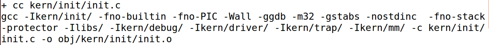
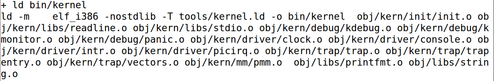
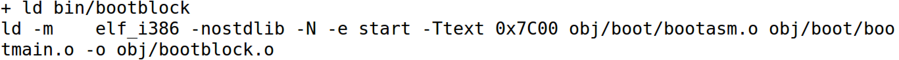
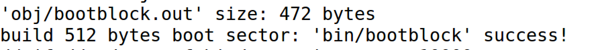
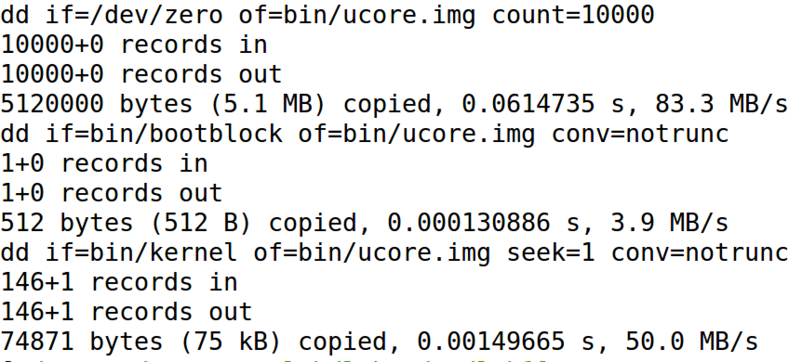
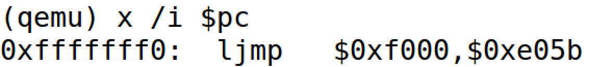
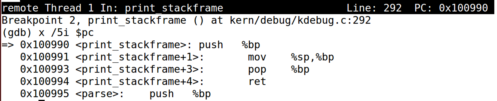
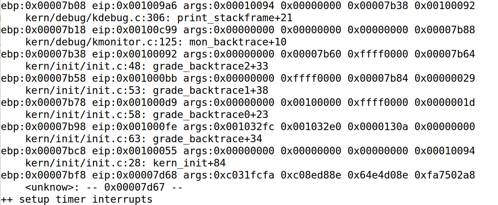

## Lab1 实验报告

### 练习1 理解通过make生成执行文件的过程

* 操作系统镜像文件ucore.img是如何一步一步生成的？(需要比较详细地解释Makefile中每一条相关命令和命令参数的含义，以及说明命令导致的结果)

  > 在ubuntu虚拟机中，在lab1目录下运行"make V="命令，观察Makefile运行的细节，结合静态阅读Makefile代码，得出编译过程如下：

  * 执行编译器内核文件，即kern目录下的文件（init、libs、debug、driver、trap、mm中包括的各个文件），生成可重定向执行.o文件，从而进一步生成kernel。

    **对应的Makefile代码为：**

    ```makefile
    KINCLUDE	+= kern/debug/ \
    			   kern/driver/ \
    			   kern/trap/ \
    			   kern/mm/
    KSRCDIR		+= kern/init \
    			   kern/libs \
    			   kern/debug \
    			   kern/driver \
    			   kern/trap \
    			   kern/mm
    KCFLAGS		+= $(addprefix -I,$(KINCLUDE))
    //生成可执行.o文件
    $(call add_files_cc,$(call listf_cc,$(KSRCDIR)),kernel,$(KCFLAGS))
    KOBJS	= $(call read_packet,kernel libs)
    ```

    **其中涉及的关键命令参数及其意义如下：**

    > 大量的.o文件生成方式都一样，以第一个被执行的init.c生成init.o的为例：

    

    * -fno-builtin : 禁止使用隐含规则，即禁止使用C语言自己的函数
    * -fno-PIC : 显式指定禁止PIC，位置无关代码
    * -Wall : 指定编译的时候现实所有的警告，方便调试
    * -ggdb : 产生专门给GDB调试的信息
    * -m32 : 交叉编译选项，生成32位代码
    * -gstabs : 使用 stabs格式
    * -nostdinc : 不要在标准系统目录中寻找头文件
    * -fno-stack-protector : 不使用栈完整性确认（金丝雀）机制

  * 生成kernel，将上一步生成的诸多.o文件链接为ELF可执行文件。

    **对应的Makefile代码如下：**

    ```makefile
    // 生成kernel
    kernel = $(call totarget,kernel)
    $(kernel): tools/kernel.ld
    $(kernel): $(KOBJS)
    	@echo + ld $@
    	$(V)$(LD) $(LDFLAGS) -T tools/kernel.ld -o $@ $(KOBJS)
    	@$(OBJDUMP) -S $@ > $(call asmfile,kernel)
    	@$(OBJDUMP) -t $@ | $(SED) '1,/SYMBOL TABLE/d; s/ .* / /; /^$$/d' > $(call symfile,kernel)
    $(call create_target,kernel)
    ```

    **其中其中涉及的关键命令参数及其意义如下：**

    

    * -m elf_i386 : 指定交叉编译生成i386代码
    * -nostdlib :  不连接系统标准启动文件和标准库文件,只把指定的文件传递给连接器。
    * -T tools/kernel.ld :  只链接指定的脚本

  * 编译boot文件夹下的文件，生成相应的.o文件，与第一步中的过程大致相似，在此不再赘述。

  * 生成bootloader，将上一步编译出的诸多.o文件链接为bootloader（其中的OBJDUMP、OBJCOPY不知道为什么在输出信息中没有体现出来）

    **对应的Makefile代码如下：**

    ```makefile
    //生成可执行.o文件
    bootfiles = $(call listf_cc,boot)
    $(foreach f,$(bootfiles),$(call cc_compile,$(f),$(CC),$(CFLAGS) -Os -nostdinc))
    //生成bootloader
    bootblock = $(call totarget,bootblock)
    $(bootblock): $(call toobj,$(bootfiles)) | $(call totarget,sign)
    	@echo + ld $@
    	$(V)$(LD) $(LDFLAGS) -N -e start -Ttext 0x7C00 $^ -o $(call toobj,bootblock)
    	@$(OBJDUMP) -S $(call objfile,bootblock) > $(call asmfile,bootblock)
    	@$(OBJCOPY) -S -O binary $(call objfile,bootblock) $(call outfile,bootblock)
    	@$(call totarget,sign) $(call outfile,bootblock) $(bootblock)
    $(call create_target,bootblock)
    ```

    **其中其中涉及的新的关键命令参数及其意义如下：**

    

    * -N : 设置代码段和数据段为“可读可写”，不对数据区进行页对齐，不链接标准库。
    * -e start :   指定入口为start函数
    * -Ttext 0x7c00 : 连接时将初始地址重定向为0x7c00

  * 生成512字节的扇区，用以存放bootloader。

    

  * 使用dd命令，生成ucore.img镜像

    **对应的Makefile代码如下：**

    ```makefile
    // 生成ucore.img镜像
    UCOREIMG	:= $(call totarget,ucore.img)
    
    $(UCOREIMG): $(kernel) $(bootblock)
    	$(V)dd if=/dev/zero of=$@ count=10000
    	$(V)dd if=$(bootblock) of=$@ conv=notrunc
    	$(V)dd if=$(kernel) of=$@ seek=1 conv=notrunc
    
    $(call create_target,ucore.img)
    ```

    **其中其中涉及的新的关键命令参数及其意义如下：**

    

    * if ：指定输入文件
    * of ：指定输出文件
    * count ：只拷贝后跟数值的block
    * conv=notrunc ：不截断输出文件
    * seek：数据拷贝起始block寻址

* 一个被系统认为是符合规范的硬盘主引导扇区的特征是什么？

  > 阅读tools/sign.c文件，即可得出答案，较为简单

  * 一个被系统认为是符合规范的硬盘主引导扇区的特征是其大小为512字节，且最后两个字节依次为0x55，0xAA 。

### 练习2 使用qemu执行并调试lab1中的软件

* 从CPU加电后执行的第一条指令开始，单步跟踪BIOS的执行

  > 仿照学堂在线和实验指导书上的方式，查看 labcodes_answer/lab1_result/tools/lab1init 文件，在Makefile中添加以下代码，以实现让qemu把它执行的指令给记录下来，并保存到q.log中去，并和gdb相结合来调试bootloader

  ```makefile
  lab1-bios: $(UCOREIMG)
  	$(V)$(TERMINAL) -e "$(QEMU) -S -s -d in_asm -D $(BINDIR)/q.log -monitor stdio -hda $< -serial null"
  	$(V)sleep 2
  	$(V)$(TERMINAL) -e "gdb -tui -q -x tools/lab1Bios"
  ```

  > 仿照学堂在线上展示的lab1init文件中的内容，在tools文件夹下新增lab1Bios文件，加载kernel，与qemu通过TRP进行连接，并指定初始的时候BIOS进入16位的8086的实模式。内容如下：

  ```makefile
  file bin/kernel
  target remote :1234
  set architecture i8086
  ```

  > 接下来，在lab1目录下，执行“make lab1-bios”指令，即可进入调试模式，紧接着只需要在gdb调试界面下逐步输入“si”指令（或者在qemu调试界面下逐步输入“x /i $pc”）即可实现对BIOS的单步跟踪。

  通过上述实验，得出第一条指令为：

  

* 在初始化位置0x7c00设置实地址断点,测试断点正常

  > 在上一步的基础上，在lab1Bios文件后面添加如下代码，以实现断点的设置与调试：

  ```makefile
  b *0x7c00
  continue
  x /2i $pc
  ```

  经过测试，断点正常。

  

* 从0x7c00开始跟踪代码运行,将单步跟踪反汇编得到的代码与bootasm.S和 bootblock.asm进行比较

  > 与上一步中操作基本一致，将2条命令改为20条即可。得出结果如下：

  经过观察`q.log`输出，，二者的代码基本相同（意为具体指令和指令的顺序一样，语法不一定完全一样）

  可以通过直接看`q.log`文件即可证明，在此不再截图赘述。

* 自己找一个bootloader或内核中的代码位置，设置断点并进行测试

  选择内核中的代码位置print_stackframe函数位置，在此函数位置设置断点并进行测试（依次执行“make lab1-bios”、“b print_stackframe” 、“continue”指令），断点停在了“0x100990”的指令处，结果如下（输出5条指令）：

  

### 练习3 分析bootloader进入保护模式的过程

* BIOS将通过读取硬盘主引导扇区到内存，并转跳到对应内存中的位置执行bootloader。请分析bootloader是如何完成从实模式进入保护模式的。

  Intel早期的8086CPU只提供了20根地址线，寻址范围只有1MB，当寻址的内存超过1MB的时候则会发生“回卷”的现象。而下一代的基于Intel 80286 CPU提供了24根地址线，寻址范围扩展到了16MB，此时为了向下兼容，于是出现了A20 GATE来模仿“回卷”。具体的，通过修改A20地址线可以完成从实模式到保护模式的转换。

  bootloader一开始是处于实模式下，A20地址线控制是被屏蔽的（都为0），很显然，在实模式下访问超过1MB的内存的时候，A20地址线是不能被屏蔽的；进入保护模式后更加不能被屏蔽，否则只能访问奇数兆的内存，无法有效访问所有内存。因此，bootloader从实模式切换到保护模式的大致过程可以分为：初始化寄存器；开启A20；初始化GDT表；使能并进入保护模式。（bootasm.S中体现）

  结合bootasm.S的代码，分析如下：

  * 禁止中断、字符串操作增加(通过两个命令分别完成)。

    ```c++
    cli                                        # Disable interrupts
    cld                                        # String operations increment
    ```

  * 初始化数据段寄存器，置初值为0。

    ```
    xorw %ax, %ax                                   # Segment number zero
    movw %ax, %ds                                   # -> Data Segment
    movw %ax, %es                                   # -> Extra Segment
    movw %ax, %ss                                   # -> Stack Segment
    ```

  * 开启A20，使能地址线，具体步骤为：等待8042 Input buffer为空；发送P2命令到8042 Input buffer；等待8042 Input buffer为空；将P2得到字节的第二位置1，并写入8042 Input buffer。

    ```
    seta20.1:
        inb $0x64, %al          # Wait for not busy(8042 input buffer empty).
        testb $0x2, %al
        jnz seta20.1
        movb $0xd1, %al         # 0xd1 -> port 0x64
        outb %al, $0x64         # 0xd1 means: write data to 8042's P2 port
    seta20.2:
        inb $0x64, %al         	# Wait for not busy(8042 input buffer empty).
        testb $0x2, %al
        jnz seta20.2
        movb $0xdf, %al         # 0xdf -> port 0x60
        outb %al, $0x60  
    ```

  * 初始化GDT表（直接读入）。

    ```
    lgdt gdtdesc
    ```

  * 使能CR0寄存器的PE位，跳转到32位代码段，切换到32位模式，完成到保护模式的转换。

    ```
    movl %cr0, %eax
    orl $CR0_PE_ON, %eax
    movl %eax, %cr0
    # Jump to next instruction, but in 32-bit code segment.
    # Switches processor into 32-bit mode.
    ljmp $PROT_MODE_CSEG, $protcseg
    ```

  * 设置32位模式下的段寄存器，建立保护模式下的堆栈及其指针。并调用bootmain函数。

    ```
    .code32                                       # Assemble for 32-bit mode
    protcseg:
        # Set up the protected-mode data segment registers
        movw $PROT_MODE_DSEG, %ax                 # Our data segment selector
        movw %ax, %ds                             # -> DS: Data Segment
        movw %ax, %es                             # -> ES: Extra Segment
        movw %ax, %fs                             # -> FS
        movw %ax, %gs                             # -> GS
        movw %ax, %ss                             # -> SS: Stack Segment
        # Set up the stack pointer and call into C. The stack region is from 0--start(0x7c00)
        movl $0x0, %ebp
        movl $start, %esp
        call bootmain
    ```

### 练习4 分析bootloader加载ELF格式的OS的过程

通过阅读bootmain.c，了解bootloader如何加载ELF文件。通过分析源代码和通过qemu来运行并调试bootloader&OS。

* bootloader如何读取硬盘扇区的？

  一般主板有2个IDE通道，每个通道可以接2个IDE硬盘。通过阅读bootmain.c源代码，从其中的IO地址设置可以看出，我们的ucore实验中采用的第一个IDE通道的主盘。读取硬盘扇区的大致步骤可以分为：等待磁盘准备好；发出读取扇区的命令；再次等待磁盘准备好；把磁盘数据读取到指定内存。

  结合bootmain.c的代码，分析如下（readsect函数实现读取一个硬盘扇区）：

  ```c
  waitdisk();		//while循环实现，具体可以参看其函数实现，当0x1f7不为忙状态时，可以读
  outb(0x1F2, 1); // 设置要读写的扇区数为1
  outb(0x1F3, secno & 0xFF);//写入希望读取的扇区号
  outb(0x1F4, (secno >> 8) & 0xFF);//写入希望读取的扇区号；
  outb(0x1F5, (secno >> 16) & 0xFF);//写入希望读取的扇区号；
  outb(0x1F6, ((secno >> 24) & 0xF) | 0xE0);//写入希望读取的扇区号；
  outb(0x1F7, 0x20);//写入0x20命令，开始读取扇区
  waitdisk();//再次while循环实现等待，当0x1f7不为忙状态是，可以读
  insl(0x1F0, dst, SECTSIZE / 4);//读取一个扇区的内容到指定内存中
  ```

* bootloader是如何加载ELF格式的OS？

  加载ELF格式的OS的主要过程体现在bootmain.c文件中的bootmain函数内，下面通过对bootmain函数的注释解释，来分析bootloader加载ELF格式的OS的过程：

  ```c
  readseg((uintptr_t)ELFHDR, SECTSIZE * 8, 0);//调用readseg函数读取ELF文件头，其中readseg函数通过调用上述的readsect函数实现
  if (ELFHDR->e_magic != ELF_MAGIC) {//以MAGIC值判断读取到的ELF文件头是否合法
      goto bad;				//如果不合法则转向bad代码段（坏情况）
  }
  struct proghdr *ph, *eph;  //申明用来存储偏移和入口数目
  ph = (struct proghdr *)((uintptr_t)ELFHDR + ELFHDR->e_phoff);//获取ph表的偏移
  eph = ph + ELFHDR->e_phnum;//获取ph表的入口数目
  for (; ph < eph; ph ++) {//遍历ph表中所有项
      //以扇区为单位读取其中变量数据到指定内存中去
      readseg(ph->p_va & 0xFFFFFF, ph->p_memsz, ph->p_offset);
  }
  ((void (*)(void))(ELFHDR->e_entry & 0xFFFFFF))();//跳转到ELF头存储的入口虚拟地址
  bad:
  outw(0x8A00, 0x8A00);
  outw(0x8A00, 0x8E00);
  while (1);
  ```

### 练习5 实现函数调用堆栈跟踪函数

> 按照kdebug.c中的函数print_stackframe中的提示步骤逐一完成即可，按照（1）-（3）的步骤提示完成即可，较为简单，需要注意的是虚拟机中的C库版本较低，for循环的书写需要在外申明循环变量，并且对ebp的值的边界条件需要注意非零，对地址的引用的取得也是需要注意的地方，其他在思路上都没有什么难的地方。

**实验代码及注释：**

```c
uint32_t valueEbp = read_ebp(); //获取当前ebp
uint32_t valueEip = read_eip(); //获取当前eip
int i = 0;					    //申明循环变量
for (i ; i < STACKFRAME_DEPTH; i++) { //循环跟踪栈的调用关系
    if(valueEbp != 0) {         	  //对ebp值边界条件判断
        cprintf("ebp:0x%08x eip:0x%08x args:", valueEbp, valueEip); //按格式打印
        int j = 0;					  //申明循环变量
        for (j ; j < 4; j ++) {  								//按次序打印参数
            uint32_t args = *((uint32_t*)valueEbp + 2 + j); 	//获取参数
            cprintf("0x%08x ", args); 
        }
        cprintf("\n"); 
        print_debuginfo(valueEip - 1);         // 打印当前函数名称和行数
        valueEip = *((uint32_t*)valueEbp + 1); //弹出栈帧，eip用返回地址代替
        valueEbp = *((uint32_t*)valueEbp);     //弹出栈帧，ebp用caller‘s ebp代替
    }
}
```

**实验结果及数值意义：**



经观察，实验输出与实验指导书中给出的结果大致一致，经过分析栈帧的特点，最后一行输出的信息应该是对应第一个使用堆栈的函数的相应信息，其中各个数值的含义如下：

* ebp：基址指针
* eip：当前PC位置的下一条指令地址
* args：函数调用时传入的参数
* \<unknow>: -- 0x00007d67 -- 表示进行函数调用的时候的程序地址

### 练习6 完善中断初始化和处理

* 中断描述符表（也可简称为保护模式下的中断向量表）中一个表项占多少字节？其中哪几位代表中断处理代码的入口？

  答：中断描述符表中一个表项占用8字节，其中0、1字节和6、7字节共同组成offset地址偏移，2、3字节则是段选择子，段选择子与地址偏移共同组成中断处理代码的入口。

* 请编程完善kern/trap/trap.c中对中断向量表进行初始化的函数idt_init。在idt_init函数中，依次对所有中断入口进行初始化。使用mmu.h中的SETGATE宏，填充idt数组内容。每个中断的入口由tools/vectors.c生成，使用trap.c中声明的vectors数组即可。

  > 主要是按照注释中和实验指导书中给出的逻辑，注意对中断异常的不同情况的处理，结合piazza上面的对本部分的讨论，我对中断异常处理分为三类，T_SYSCALL、T_SWITCH_TOK、中断号小于32的（trap gate）、中断号在[32，255]的（interrupt gate）。针对不同的类型对SETGATE传入不同的参数即可。

  **实验代码及注释：**

  ```c
  extern uintptr_t __vectors[]; //获得中断入口数组
  int i = 0;					  //申明循环变量
  for (i ; i < 256 ; i ++) {    //对中断号进行循环
      if(i != T_SYSCALL && i != T_SWITCH_TOK && i >= IRQ_OFFSET) {
          //中断号在[32，255]的（interrupt gate）
          SETGATE(idt[i], 0, GD_KTEXT, __vectors[i], DPL_KERNEL);
      } else {
          if(i == T_SYSCALL || i == T_SWITCH_TOK) {
              //T_SYSCALL、T_SWITCH_TOK 应该拥有USER特权
              SETGATE(idt[i], 1, GD_KTEXT, __vectors[i], DPL_USER);
          } else if(i < IRQ_OFFSET) {
              //中断号在[0，31]的（interrupt gate）
              SETGATE(idt[i], 1, GD_KTEXT, __vectors[i], DPL_KERNEL);
          }
      }
  }
  lidt(&idt_pd);//让CPU知道IDT表位置
  ```

* 请编程完善trap.c中的中断处理函数trap，在对时钟中断进行处理的部分填写trap函数中处理时钟中断的部分，使操作系统每遇到100次时钟中断后，调用print_ticks子程序，向屏幕上打印一行文字”100 ticks”。

  > 实现较为简单，正如注释提示中说的那样，“Too Simple”。

  **实验代码及注释：**

  ```c
  ticks = ticks + 1;    //时钟计数
  if(ticks % 100 == 0) {//当时钟为100的整数的时候
  	print_ticks();    //打印信息
  }
  ```

### 扩展练习 


### 本人实现与参考答案的区别

* 练习1：参考答案在解释ucore.img的生成过程的时候更加体现了清晰的层次性，前后步骤之间的关系逻辑也很清晰，而我则更注重与静态代码的分析和Makefile运行时命令的先后顺序了，这一点没有参考答案那样具有很好的逻辑性。
* 练习2：基本实现的思路和参考答案没有不同，唯一不同的地方是，参考答案直接修改了项目中的tools/gdbinit，而我则是新建了一个tools/lab1Bios，并且使用“make lab1-bios”的命令进行单步调试。
* 练习3：与参考答案解释的内容大致一样，不同的地方在于我和参考答案将相关代码的步骤划分产生了分歧。个人感觉这无关紧要，只要对过程的理解解释是一样的就行了。
* 练习4：参考答案中还详细解释了readseg函数的实现，而我直接将其作为一个中间过程的调用一笔带过了，因为我认为这个中间过程的调用并不本质，readseg的意义就在于调用readsect而已。
* 练习5：有关代码的部分由于实验给出的注释提示已经足够详细可靠，所以与参考答案基本一致，在问题的回答上，我没有指明第一个使用堆栈的函数就是bootmain.c中的bootmain。
* 练习6：在这一练习中代码实现上与参考答案最大的不同就是对不同类型中断异常的划分，我参考了piazza上对于这一部分的讨论，个人感觉比较赞同所以借鉴其实现。应该区分异常和中断对SETGATE函数的istrap参数进行不同的设置，否则在后期或者一些特殊情况下会出现意想不到的问题。

### 有关OS原理课的知识点

* 练习1：主引导扇区格式、编译链接生成bootloader过程
* 练习2：BIOS、x86的实模式与保护模式
* 练习3：bootloader的启动过程、GDT表相关内容、
* 练习4：ELF文件格式及其加载方式、bootloader读取硬盘过程
* 练习5：函数调用中堆栈的使用
* 练习6：中断与异常、中断处理向量和中断描述符表的相关内容
* LAB1中尚未涉及的重要知识点：进到BIOS之后的硬件自检POST、系统设备启动顺序、段机制与页机制的处理等。


