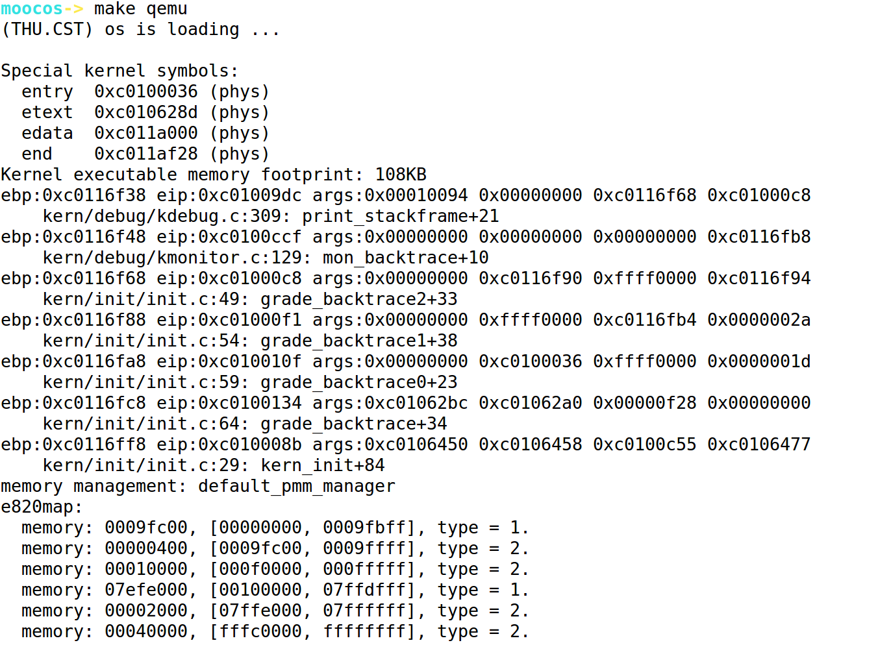
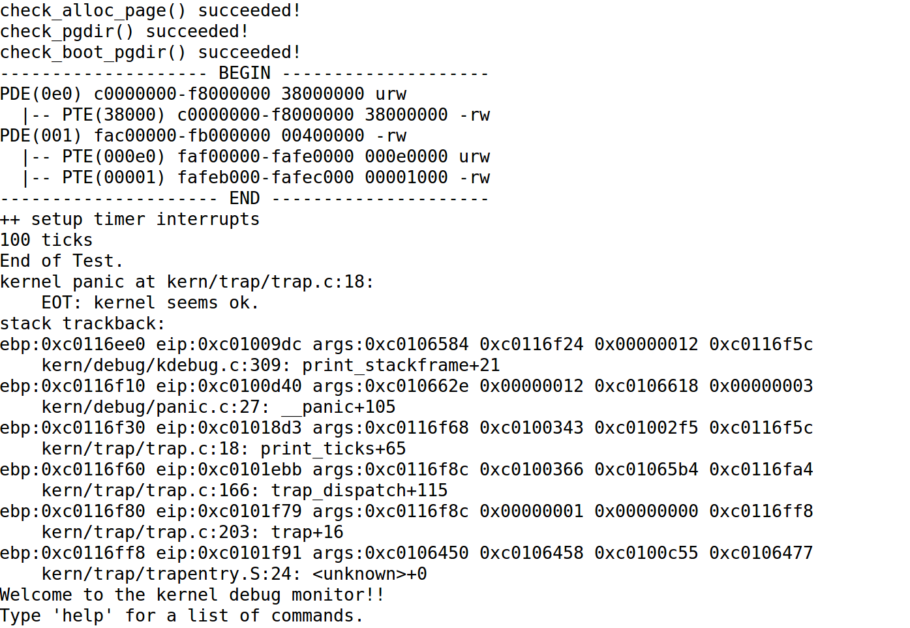

## Lab2 实验报告

### 练习0 填写已有实验

本实验依赖实验1。将实验一中代码填入本实验有“LAB1”的注释对应部分。

### 练习1 实现first-fit连续物理内存分配算法

依次重写函数default_init,default_init_memmap,default_alloc_pages, default_free_pages。

* default_init函数：使用free_list链表来存储空闲内存块，置nr_free(总的空闲内存块数目)为0。这一函数原框架中已经实现的很好，故而不需要重写。

* default_init_memmap函数：初始化空闲内存块，实质上就是初始化当前空闲内存块中每一页，具体的操作就是置一些标志位的初始值，已经更新当前总的空闲内存块数目。这一函数原框架也已经实现完全，故而不需要重写。

* default_alloc_pages函数：按照注释中给出的实现思路，通过一个while循环搜索到第一个大于或者等于n的空闲内存块，找到该内存块之后按照提示则是对块中前n个页面的分配，对这些页面的标志位进行重置，需要注意的是，当内存块大小大于n的时候，需要重新计算分配后剩余的空闲内存块，并改表链表中的依赖关系，最后更新一下总的空闲内存块数目，从链表中删去被分配掉的内存块即可，具体改动与原框架中差别不大，在此不再赘述，具体实现请看代码。

* default_free_pages函数：其实释放页面本质上就是分配页面的逆操作，大致的实现步骤为，首先找到插入的正确位置并确定正确位置附近前后是否有可以合并的空闲块，分情况进去插入链表、合并空闲块操作。值得注意的是，需要考虑等待释放的地址前后是否有可以合并的空闲块，如果有，则需要分情况进行不同的处理。具体的情况，见如下代码及其注释：

  ```c
  static void default_free_pages(struct Page *base, size_t n) {
      assert(n > 0);
      struct Page *p = base;
      for (; p != base + n; p ++) {
          assert(!PageReserved(p) && !PageProperty(p));
          p->flags = 0;
          set_page_ref(p, 0);
      }
      base->property = n;
      SetPageProperty(base);
      struct Page *behind = NULL;//记录后面可以合并的
      struct Page *before = NULL;//记录前面可以合并的
      bool hasBehind = 0;//是否有后面可以合并的
      bool hasBefore = 0;//是否有前面可以合并的
      bool bigSmall = 0;//base地址附近没有可以合并的块，记录base块应该插入p的前还是后？
      list_entry_t *le = list_next(&free_list);
      while (le != &free_list) {
          p = le2page(le, page_link);
          le = list_next(le);	
          if (p + p->property == base) {//找到base前面可以合并的块
              before = p;
  	    	hasBefore = 1;
          } else if (base + base->property == p) {//找到base后面可以合并的块
              behind = p;
  	    	hasBehind = 1;
  	    	break;//后面的找到就没比较继续遍历了
          }
  		if(p > base && p != base + base->property) {//超过base范围仍未找到可合并
  	    	bigSmall = 1; //p在base的后面
  	    	break;//此时没有必要继续遍历了
          }
      }
      nr_free = nr_free + n; //重新计算nr_free
      if(!hasBefore && !hasBehind && bigSmall) {//无可合并，直接将base加入链表即可
  		list_add_before(&(p->page_link), &(base->page_link));//base在p前的情况
      } else if(!hasBefore && !hasBehind && !bigSmall) {
  		list_add_before(&free_list, &(base->page_link));
      }
      //合并操作
      if(hasBefore) {//先合并前面的块
      	before->property = before->property + base->property;
  		ClearPageProperty(base);
  		base = before; //此时base是合并后的块
      }
      if(hasBehind) {//继续合并后面的块
      	base->property = base->property + behind->property;
  		ClearPageProperty(behind);
          if(!hasBefore) {
             list_add_before(&(behind->page_link), &(base->page_link));
          }
  		list_del(&(behind->page_link));
      }
  }
  ```

* 回答问题：本人实现的first-fit算法的进一步改进空间？
  * 从数据结构的角度考虑，页面的分配与释放的过程的算法复杂度均为O(n)，仅仅针对first-fit的优化而言，我认为这是由于双向循环链表这一特殊数据结构的限制，不考虑整个项目其他方面，为了优化页面的分配与释放，我认为可以采取插入删除性能更好的“二叉树”来代替链表，这样最起码可以将本来的线性搜索变为二分搜索，性能肯定会快很多。
  * 从算法本身的角度考虑，first-fit 算法容易造成低地址碎片，可以尝试最优匹配、最差匹配等策略在替换，或者结合起来使用。

### 练习2 实现寻找虚拟地址对应的页表项

* 按照注释中给出思路逐步实现即可，大致分为8步，见如下代码及其注释：

```c
	// (1) find page directory entry
	pde_t *pdep = pgdir + PDX(la);
	//（2）check if entry is not present
	if(!(PTE_P & *pdep)) {   //不存在
	//(3) check if creating is needed
	    if(create) {	//需要创建二级页表
	       struct Page* newPage = alloc_page();//创建一个新的页面
	// (4) set page reference
	       set_page_ref(newPage, 1);
	//(5) get linear address of page
	       uintptr_t paPage = page2pa(newPage);
	       pte_t laPage = KADDR(paPage);
	//(6) clear page content using memset
	       memset(laPage, 0, PGSIZE);
	//(7) set page directory entry's permission
	       *pdep = ((paPage & ~0x0FFF) | PTE_U | PTE_W | PTE_P);
	    } else {
	        return NULL;
	    }
	}
	// (8) return page table entry
	pte_t *pte = (pte_t *)(KADDR((*pdep & ~0xFFF))) + PTX(la);
	return pte; 
```

首先判断对应的页目录项是否存在，如果不存在且有create的要求，则需要重现创建一个新的页表，其中页目录项内容为：**（页表起始物理地址 & ～0xFFF）|PTE_U|PTE_W|PTE_P**。最后，最后，返回页目录项中所指出的页表中的页表项内容即可。

* 回答问题：请描述页目录项（Page Directory Entry）和页表项（Page Table Entry）中每个组成部分的含义以及对ucore而言的潜在用处。

  * 页目录项（Page Directory Entry）：
    * 31-12:对应的4kb页表起始地址，在ucore中也是表示页表的地址。
    * 11-9：Avail可以由软件自由修改，不受kernel或硬件的控制。在ucore中对应PTE_AVAIL。
    * 8：Ignored，G位。
    * 7：S，即Page Size，在ucore中用处不大，因为ucore中页面大小固定。
    * 6：0位，对应ucore中的PTE_MBZ。
    * 5、4、3：分别为A、D、W位，与Cache相关，用于发现页面是否已被读取或写。入、'Cache **D** isable'位、是否启用直写式高速缓存等功能。在ucore中的潜在用处是当ucore与硬件cache交互的时候起到控制的作用。
    * 2：' **U** ser / Supervisor'位，根据权限级别控制对页面的访问。uCore可以通过这些位进行用户态和内核态程序访问权限的控制。
    * 1：' **R** ead / Write'权限标志，如果该位置1，则页面是可读/写的。否则，当未设置时，页面是只读的。
    * 0：' **P** resent'。如果该位置位，则该页面实际上处于物理内存中。在ucore中根据这一位来判断页表是否存在，从而判断是否需要新建页表。

  * 页表项（Page Table Entry）：

    > 仅对页表项特有的位进行阐述，很多与页目录项基本一样

    * 31-12:4kb对齐的物理地址。但是，与以前不同，地址不是页表的地址，而是4 KiB的物理内存块，然后映射到页表和目录中的该位置。
    * 8：G位，如果设置了**G**或**G** lobal标志，则在CR3重置时阻止TLB更新其缓存中的地址。请注意，必须将CR4中的页面全局启用位设置为启用此功能。
    * 7:0位，如果支持PAT，则应指示存储器类型。否则，它必须为0。
    * 6:D位，**D** irty标志（如果已设置）表示已写入页面。CPU不会更新此标志，一旦设置将不会自行设置。
    * 4:'**C** ached'是页目录项中的'D'位。与其相同。

* 回答问题：如果ucore执行过程中访问内存，出现了页访问异常，请问硬件要做哪些事情？

  答：(1)产生页访问异常后，硬件负责将引起页访问异常的线性地址装到寄存器CR2中;(2)同时会给出错误码errorCode，ucore会把errorCode保存在struct trapframe 中的tf_err成员变量中;(3)接着将会触发Page Fault，从而启动中断服务例程。而中断服务例程会调用页访问异常处理函数do_pgfault进行具体处理。

### 练习3 释放某虚地址所在的页并取消对应二级页表项的映射

* 按照注释逐步实现即可，较为简单，具体实现见如下代码及其注释：

  ```c
  	//(1)check if this page table entry is present
  	if((*ptep & PTE_P) == 1) {
  	//(2)find correspending page to pte
  	    struct Page* page = pte2page(*ptep);
  	//(3)decrease page reference
  	    page_ref_dec(page);
  	//(4)and free this page when page reference reachs 0
  	    if(page->ref == 0) {
  	    	free_page(page);
  	    }
  	//(5)clear second page table entry
  	    *ptep = 0;
  	//(6)flush tlb
  	    tlb_invalidate(pgdir, la);
  	}
  ```

  在释放某个虚地址的时候，即删除某一个pte项的时候，先要判断其对应的页是否存在，如果存在则减少其引用数目，直到其引用数目等于0的时候，系统则对其进行回收和清除。最后还需要对tlb进行更新。

* 回答问题：数据结构Page的全局变量（其实是一个数组）的每一项与页表中的页目录项和页表项有无对应关系？如果有，其对应关系是啥？

  答：数组中的每一项与页表中的页目录项和页表项是有着对应关系的。数组中的每一项都对应物理内存中的一个页，页目录中的每一项指向的页表地址也存储在物理内存的页中，同时，页表中每一项存储的是每一页的物理内存地址，也是存储在物理内存中的。因此，页目录项保存的物理页面地址（即某个页表）以及页表项保存的物理页面地址都对应于Page数组中的某一页。

* 回答问题：如果希望虚拟地址与物理地址相等，则需要如何修改lab2，完成此事？鼓励通过编程来具体完成这个问题。

  答：从lab1与lab2的区别的角度来思考解决这个问题即可。lab2与lab2的不同在于，lab2将地址映射分为几个阶段来进行，所以，我们需要针对这几个阶段来修改相应的代码使得其虚拟地址和物理地址相等。

  * 第一阶段：虚拟地址、线性地址和物理地址之间的映射关系和lab1中一样，无需修改
  * 第二阶段：（创建初始目录页表，开启分页模式）：修改链接脚本tools/kernel.ld,将ucore起始的虚拟地址改为0x100000。
  * 第三阶段：（完善段表和页表）：修改memlayout.h中的参数KERNBASE（kernel基址）改为0x00000000
  * 第四阶段：lab2中取消了0~4M区域内存页映射机制，使用了递归自映射机制，为了使物理地址与虚拟地址相等，我们需要0～4M区域内存页映射机制来满足这种对等关系。

  修改之后，通过cprintf发现此时虚拟地址与物理地址相等，本题完成。

### 最终实验结果

make qemu：





make grade：


### 本人实现与参考答案的区别

* 练习1:
  * 本人在页面分配的过程中，我采用了for循环来分配当前块的前n个页面，这一点在参考答案中没有体现，但在原框架的注释中是有明确提示的，不知道是为什么。
  * 在进行页面释放的过程中，申明了两个Page变量来存储base块前后可以合并的空闲块
  * 在页面释放函数中，链表线性查找正确位置的时候，在找到前后可以合并的空闲块之后或者没有找到但已经不可能再找到的时候，我果断从while循环中break了出来，一定程度上又花了程序的性能，减少了时间复杂度。
  * 除此之外，对于链表的插入，我采用了多个bool变量来标记，以他们的布尔值的组合作为释放的条件判断，逻辑上比参考答案更加清晰。

* 练习2:基本按照框架中给出的注释伪代码编程，基本无区别

* 练习3:基本按照框架中给出的注释伪代码编程，基本无区别

### 有关OS原理课的知识点

* 练习1:内存分配算法、内存释放算法、First-Fit算法
* 练习2和练习3:页式存储管理的地址映射、二级页表分页机制、pde和pte的结构及其功能
* 尚未涉及的知识点：反置页表在ucore中没有体现、段式存储管理在ucore中过于简单、各种分配算法没有全部涉及到、碎片的整理没有涉及

