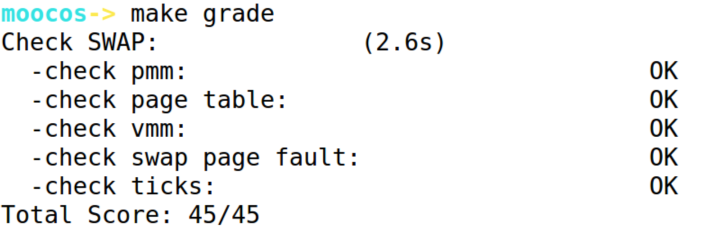
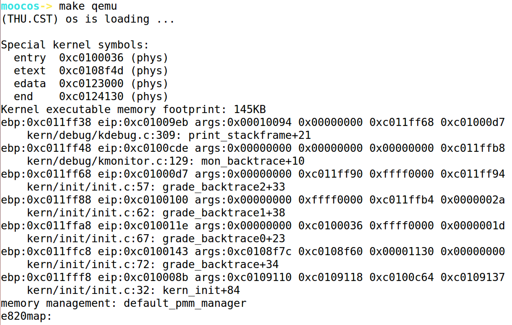
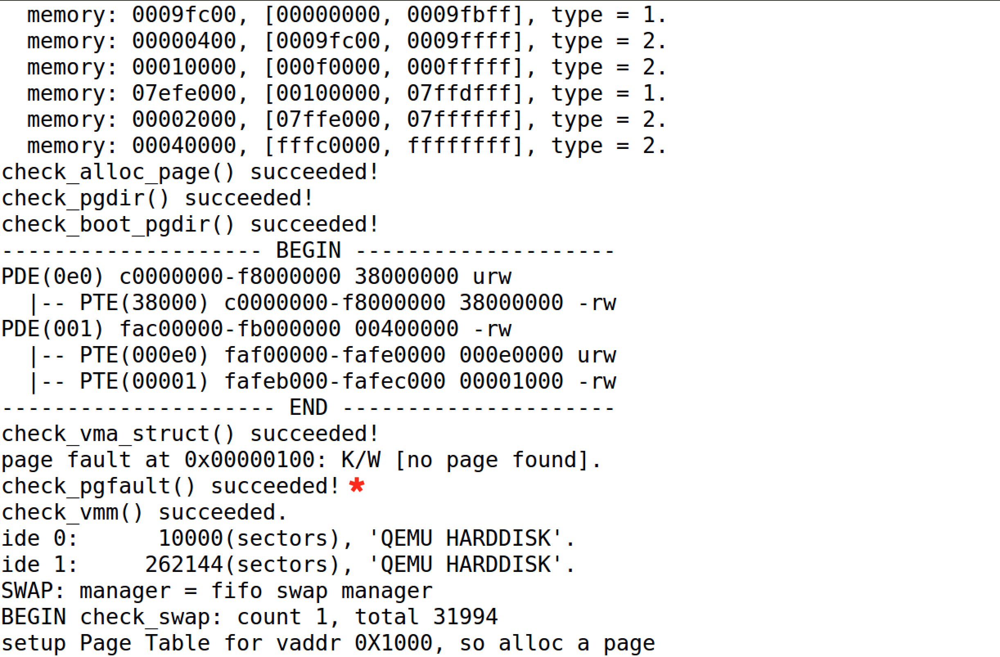
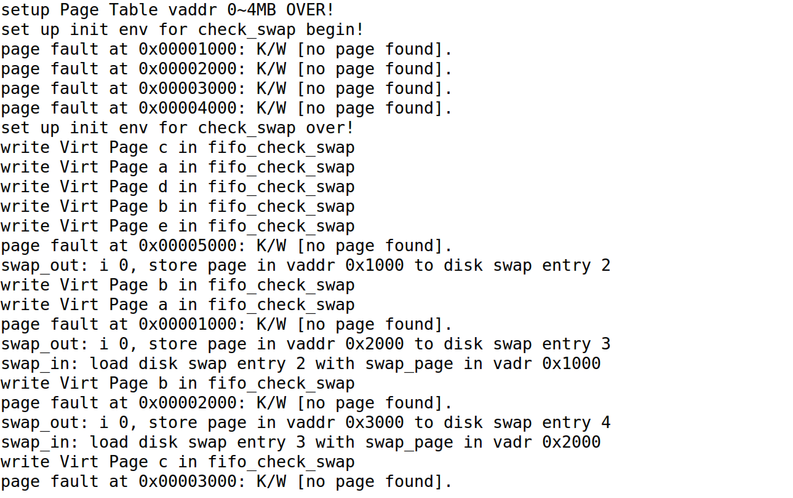
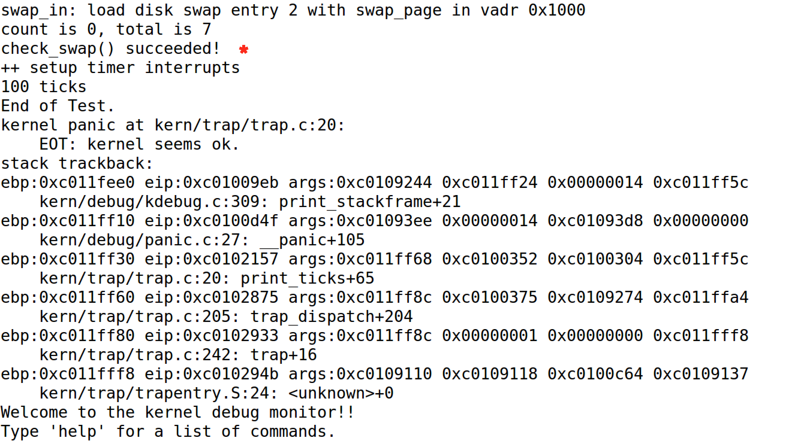

## Lab3 实验报告

### 练习0 填写已有实验

本实验依赖Lab1，Lab2。将Lab1，Lab2中自己所写的代码填入本实验中对应部分即可。

### 练习1 给未被映射的地址映射上物理页

* 设计实现

  由于给出的实验框架中已经给出了大致的伪代码（即if-else分支结构）以及充足的注释，加上本身代码量就不大，所以整体的编程难度不大。主要是理解我们需要完成的任务，即给未被映射的地址映射上物理页。更为细节地说，那么我们要做的就是申请一个空闲物理页，并建立好虚实映射关系，从而使得这样的“合法”虚拟页有实际的物理页帧对应。具体的函数调用，调用函数pgdir_alloc_page()即可。在此之后，此时页表项对应物理地址存在，但不存在于内存中，需要进行换入操作。根据地址从磁盘载入内存，建立映射，并设置该页可换出。需要注意的是，在设置可以换出之后，一定要设置换出的地址，否则会出现错误。具体实现代码如下：

  ```c
  //(1) try to find a pte, if pte's PT(Page Table) isn't existed, then create a PT.
  ptep = get_pte(mm->pgdir, addr, 1);  
  if (*ptep == 0) {
  //(2) if the phy addr isn't exist, then alloc a page & map the phy addr with la
  	pgdir_alloc_page(mm->pgdir, addr, perm);                    
  } else {
      if(swap_init_ok) {
          struct Page *page = NULL;
  //(1）According to the mm AND addr, try to load the content of right disk page
          swap_in(mm, addr, &page);   
  // into the memory which page managed.
          page_insert(mm->pgdir, page, addr, perm);                        
  //(2) According to the mm, addr AND page, setup the map of phy addr <-> logical addr
          swap_map_swappable(mm, addr, page, 1); //(3) make the page swappable                       
  	    page->pra_vaddr = addr;// Last set the swap address.
      } else {
          cprintf("no swap_init_ok but ptep is %x, failed\n",*ptep);
          goto failed;
      }
  }
  ```

* 请描述页目录项（Page Directory Entry）和页表项（Page Table Entry）中组成部分对ucore实现页替换算法的潜在用处。

  答：在ucore中，可以根据PDE和LA通过get_pte函数得到页表项PTE，根据PTE则可以得出放在硬盘上的页起始扇区号。对于ucore中的页替换算法，其潜在用处，我猜测是ucore可以利用PTE中的各个标志位来标记页面是否可以被换入换出，以及页面是否已经被换入换出。对于简单的FIFO算法中，PTE各个标志位的作用并不是很显著，但对于稍微复杂的clock算法以及加强版的clock算法，PTE中的这些标志位将发挥很大的潜在作用。

* 如果ucore的缺页服务例程在执行过程中访问内存，出现了页访问异常，请问硬件要做哪些事情？

  答：ucore启动缺页服务例程的前提就是系统已经发生了缺页异常，而这时候在执行例程的过程中再一次发生了异常，这则涉及到了“异常嵌套”方面的知识。在遇到这一类特殊情况的时候，硬件首先会把产生异常的地址存入CR2寄存器中，接着保存现场，将一系列信息存入栈中，启动新一轮的异常服务例程来解决问题。

### 练习2 补充完成基于FIFO的页面替换算法

* 设计实现

  练习2的代码量比练习的代码量更少，编程上并不存在难度。通过这个实验，我也深刻地理解了，操作系统实验的重点是要理解操作系统运行的原理，深入理解整个框架的设计思路和调用思路，从而进一步掌握操作系统的原理。在练习2中主要要我们实现的页面替换算法是最简单的FIFO页面替换算法，在ucore中体现为“基于链表的先进先出算法”，其换入换出思路也很简单，换入的时候将最新访问的页插入链表的尾部，换出的时候，将链表的最前面的页面换出即可。在换出的过程中注意需要将* ptr_page的值赋给此页面的地址。具体实现代码如下：

  ```c
  static int _fifo_map_swappable(struct mm_struct *mm, uintptr_t addr, struct Page *page, int swap_in)
  {
      list_entry_t *head=(list_entry_t*) mm->sm_priv;
      list_entry_t *entry=&(page->pra_page_link);
      assert(entry != NULL && head != NULL);
      //record the page access situlation
      //(1)link the most recent arrival page at the back of the pra_list_head qeueue.
      list_add(head, entry);
      return 0;
  }
  static int _fifo_swap_out_victim(struct mm_struct *mm, struct Page ** ptr_page, int in_tick)
  {
       list_entry_t *head=(list_entry_t*) mm->sm_priv;
       assert(head != NULL);
       assert(in_tick==0);
       /* Select the victim */
       list_entry_t* ealiestArrival = head->prev;
       struct Page* tempPage = le2page(ealiestArrival, pra_page_link);
       //(1)  unlink the  earliest arrival page in front of pra_list_head qeueue
       list_del(ealiestArrival);	
       //(2)  assign the value of *ptr_page to the addr of this page
       *ptr_page = tempPage;
       return 0;
  }
  ```

* 如果要在ucore上实现"extended clock页替换算法"请给你的设计方案，现有的swap_manager框架是否足以支持在ucore中实现此算法？如果是，请给你的设计方案。 如果不是，请给出你的新的扩展和基此扩展的设计方案。并需要回答如下问题：

  答：总的来说，现有的swap_manager框架是足以支持在ucore中实现"extended clock页替换算法"，原因是，在"extended clock页替换算法"中与其他算法最大的不同，是需要增添“修改位”和“访问位”来记录该页面是否被修改过和被访问过，经查看kern/mm/mmu.h中的定义，框架已经预置了PTE_A和PTE_D两个位来用于记录这两大特性。因此现有框架是可以支持的。具体的设计方案是，修改_fifo_swap_out_victim()函数即可，根据课上讲的“extended clock页替换算法”，未被访问、未被修改的页优先换出即可，如果发现某一个页表项的PTE_A位和PTE_D位均为0，则换出该页。

  * 需要被换出的页的特征是什么？

    如上所说，如果发现某一个页表项的PTE_A位和PTE_D位均为0，则换出该页。

  * 在ucore中如何判断具有这样特征的页？

    按照课上讲的“clock页替换算法”的实现，多次遍历内存中所有的页面，每次遍历到一个页面的时候修改更新PTE_A和PTE_D两个位，并同时进行判断即可。

  * 何时进行换入和换出操作？

    * 换入：当出现缺页异常，置换算法选择被换入的物理页面。
    * 换出：当需要调入新页面而内存已满了的时候，置换算法选择被换出的物理页面。

### 最终实验结果

* make grade结果

  

* make qemu结果

  

  

  

  

### 本人实现与参考答案的区别

* 练习1：答案对一重要函数的返回值进行了异常检查报错处理，这一点比我做的好，我在处理的时候没有考虑系统会出错，只是面向过程的简单对函数进行了调用。
* 练习2：答案在_fifo_swap_out_victim函数中对一些重要的值利用assert进行了判断，这一点也比我做的好，我也只是面向过程的简单对函数进行了调用，这在以后的实验中需要注意。

### 有关OS原理课的知识点

* 练习1:虚拟存储，虚实地址映射机制
* 练习2：页面置换算法，FIFO算法
* 本实验尚未涉及的知识点：Belady现象、多种局部置换算法的比较、全局置换算法