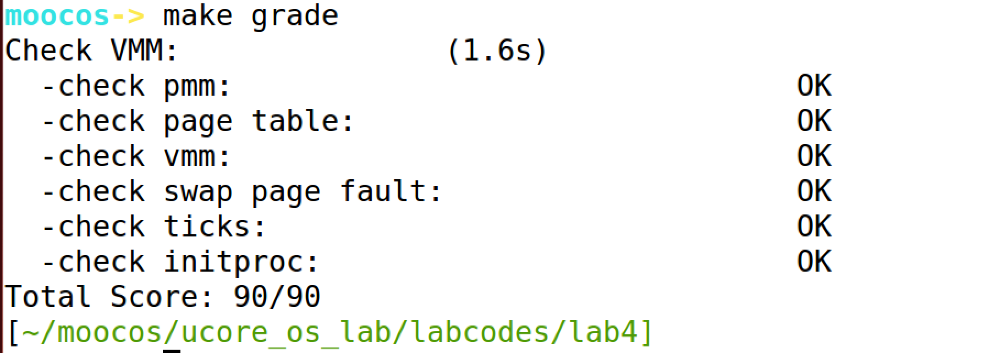
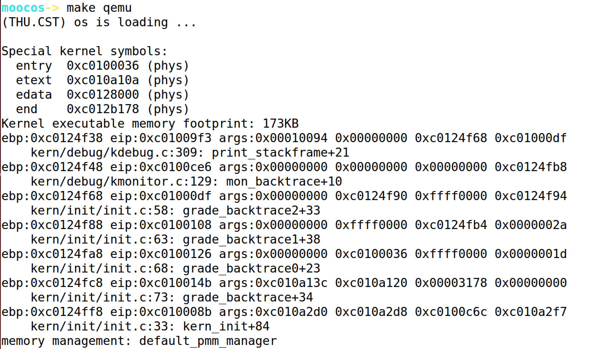
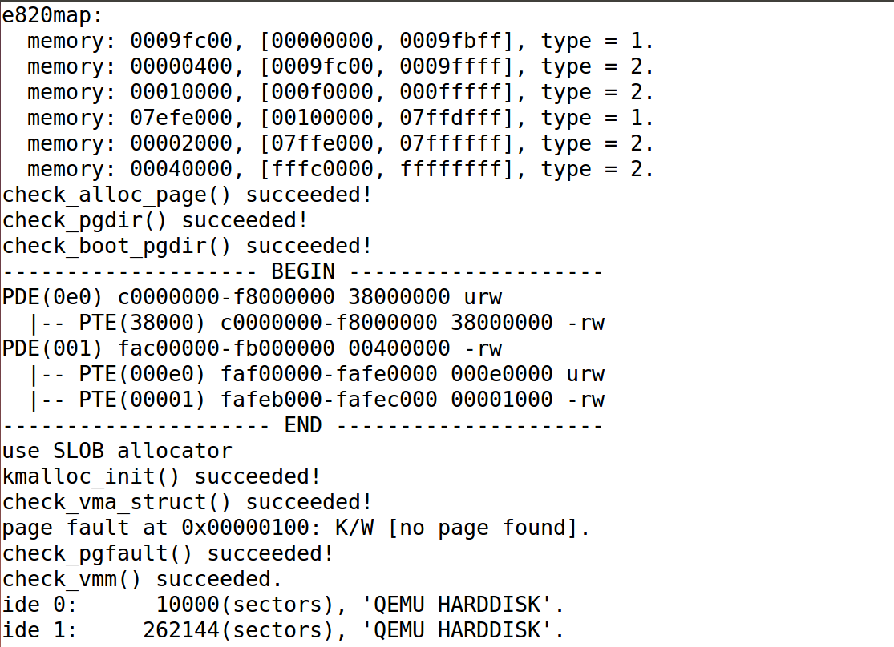
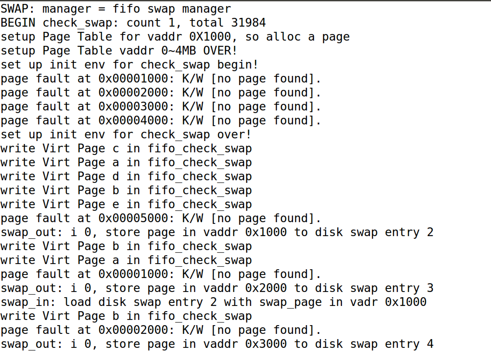
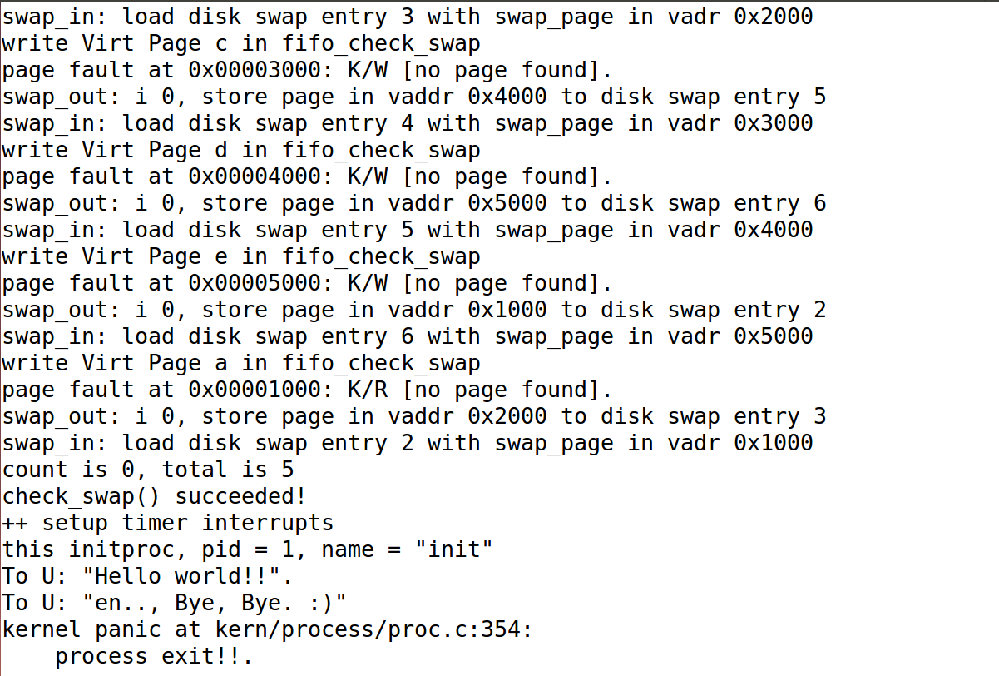
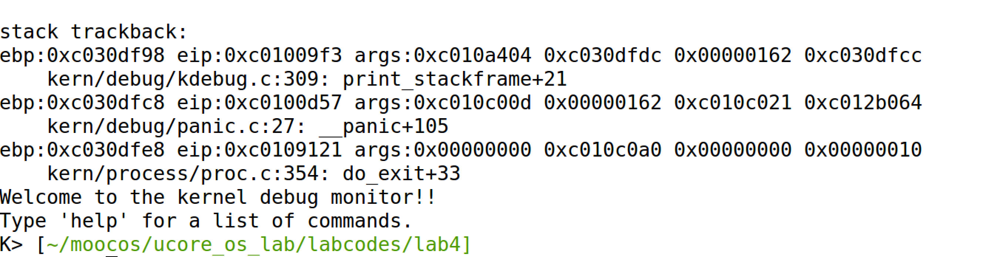

## Lab4 实验报告

### 练习0 填写已有实验

本实验依赖Lab1，Lab2，Lab3。将Lab1，Lab2，Lab3中自己所写的代码填入本实验中对应部分即可。

### 练习1 分配并初始化一个进程控制块

* 设计实现

  alloc_proc函数（位于kern/process/proc.c中）负责分配并返回一个新的struct proc_struct结 构，用于存储新建立的内核线程的管理信息。ucore需要对这个结构进行最基本的初始化。调用alloc_proc函数来通过kmalloc函数获得proc_struct结构的一块内存块，作为第0个进 程控制块。并把proc进行初步初始化（即把proc_struct中的各个成员变量清零）。但有些成员 变量设置了特殊的值，如下

  * proc->state = PROC_UNINIT;设置进程为“初始”态

  * proc->pid = -1;设置进程pid的未初始化值
  * proc->cr3 = boot_cr3;使用内核页目录表的基址

  ```c
  static struct proc_struct *alloc_proc(void) {
      struct proc_struct *proc = kmalloc(sizeof(struct proc_struct));
      if (proc != NULL) {
          proc->state = PROC_UNINIT;
          proc->pid = -1;
          proc->cr3 = boot_cr3;
          proc->runs = 0;
          proc->kstack = NULL;
          proc->need_resched = 0;
          proc->parent = NULL;
          proc->mm = NULL;
          proc->tf = NULL;
          proc->flags = 0;
          memset(&(proc->context), 0 ,sizeof(proc->context));
          memset(proc->name, 0, sizeof(proc->name));
      }
      return proc;
  }
  ```

* 请说明proc_struct中struct context context和struct trapframe *tf成员变量含义和在本实验中的作用是啥？

  **context成员变量含义及其作用：**

  ```c
  struct context {
      uint32_t eip; //指令地址寄存器
      uint32_t esp; //通用寄存器
      uint32_t ebx; //通用寄存器
      uint32_t ecx; //通用寄存器
      uint32_t edx; //通用寄存器
      uint32_t esi; //通用寄存器
      uint32_t edi; //通用寄存器
      uint32_t ebp; //通用寄存器
  };
  ```

  context即进程的上下文，用于进程切换。在uCore中，所有进程在内核中也是相对独立的。使用context保存寄存器的目的就在于在内核态中能够进行上下文之间的切换。

  **trapframe成员变量含义及其作用：**

  ```c
  struct trapframe {
      struct pushregs tf_regs;
      uint16_t tf_gs; //段寄存器gs
      uint16_t tf_padding0;
      uint16_t tf_fs; //段寄存器fs
      uint16_t tf_padding1;
      uint16_t tf_es; //段寄存器es
      uint16_t tf_padding2;
      uint16_t tf_ds; //段寄存器ds
      uint16_t tf_padding3;
      uint32_t tf_trapno;
      /* below here defined by x86 hardware */
      uint32_t tf_err; //错误信息
      uintptr_t tf_eip; //指令地址寄存器eip
      uint16_t tf_cs; //段寄存器cs
      uint16_t tf_padding4;
      uint32_t tf_eflags; //错误标志
      /* below here only when crossing rings, such as from user to kernel */
      uintptr_t tf_esp; //栈寄存器esp
      uint16_t tf_ss; //段寄存器ss
      uint16_t tf_padding5;
  } __attribute__((packed));
  ```

  trapframe即中断帧的指针，总是指向内核栈的某个位置：当进程从用户空间跳到内核空间时，中断帧记录了进程在被中断前的状态。当内核需要跳回用户空间时，需要调整中断帧以恢复让进程继续执行的各寄存器值。除此之外，uCore内核允许嵌套中断。因此为了保证嵌套中断发生时tf 总是能够指向当前的tf，uCore 在内核栈上维护了 tf 的链。

### 练习2 为新创建的内核线程分配资源

* 设计实现

  创建一个内核线程需要分配和设置好很多资源。kernel_thread函数通过调用do_fork函数完成 具体内核线程的创建工作。。ucore一般通过do_fork实际创建新的内核线程。do_fork的作用是，创建当前内核线程的 一个副本，它们的执行上下文、代码、数据都一样，但是存储位置不同。在这个过程中，需 要给新内核线程分配资源，并且复制原进程的状态。具体的实现按照原有框架中给出的注释提示逐步实现即可，这里需要注意的是，如果上述前3步执行没有成功，则需要做对应的出错处理，把相关已经占有的内存释放掉。并且在第(5)步插入子进程到链表中的过程时，为了保证子进程pid的唯一性，需要设置的中断屏蔽，这里我参考了piazza上的讨论和参考答案的实现。

  ```c
  int do_fork(uint32_t clone_flags, uintptr_t stack, struct trapframe *tf) {
      int ret = -E_NO_FREE_PROC;
      struct proc_struct *proc;
      if (nr_process >= MAX_PROCESS) {
          goto fork_out;
      }
      ret = -E_NO_MEM;
      //    1. call alloc_proc to allocate a proc_struct
  	proc = alloc_proc();
  	if(proc == NULL) {
  		goto fork_out;
  	}
      //    2. call setup_kstack to allocate a kernel stack for child process
  	int flagKstack = setup_kstack(proc);
  	if(flagKstack == -4) {
  		goto bad_fork_cleanup_proc;	
  	}
      //    3. call copy_mm to dup OR share mm according clone_flag
  	int flagMm = copy_mm(clone_flags, proc);
  	if(flagMm != 0) {
  		goto bad_fork_cleanup_kstack;		
  	}
      //    4. call copy_thread to setup tf & context in proc_struct
  	copy_thread(proc, stack, tf);
      //    5. insert proc_struct into hash_list && proc_list
  	//参考piazza和proc_run函数实现
  	bool intr_flag;
  	proc->parent = current;
  	local_intr_save(intr_flag);//保证pid的唯一性设置的中断屏蔽
  	{
  		proc->pid = get_pid(); //获取子进程的进程号
  		hash_proc(proc);//insert into hash_list
  		list_add(&proc_list, &(proc->list_link));		
  		nr_process = nr_process + 1;
  	}
  	local_intr_restore(intr_flag);
      //    6. call wakeup_proc to make the new child process RUNNABLE
  	wakeup_proc(proc);
      //    7. set ret vaule using child proc's pid
  	ret = proc->pid;
  fork_out:
      return ret;
  bad_fork_cleanup_kstack:
      put_kstack(proc);
  bad_fork_cleanup_proc:
      kfree(proc);
      goto fork_out;
  }
  ```

* 请说明ucore是否做到给每个新fork的线程一个唯一的id？请说明你的分析和理由。

  答：是的。这就是为什么需要在上述第5步中设置中断屏蔽的理由，由于进程号要求唯一性，进程号分配时可能需要查看进程列表中全部进程以避免发生冲突。若进程号已分配而进程尚未添加进进程列表时被中断，则该进程号可能会被重复分配，故进程号分配与进程添加应为原子操作。因而在进行上述操作时需关闭中断。

### 练习3 阅读代码理解 proc_run 函数和它调用的函数如何完成进程切换的

* 对proc_run函数的分析：

  ```c
  void proc_run(struct proc_struct *proc) {
      if (proc != current) {
          bool intr_flag;
          struct proc_struct *prev = current, *next = proc;
          local_intr_save(intr_flag);
          {
              current = proc;
              load_esp0(next->kstack + KSTACKSIZE);
              lcr3(next->cr3);
              switch_to(&(prev->context), &(next->context));
          }
          local_intr_restore(intr_flag);
      }
  }
  ```

  具体流程为：

  * 让current指向next内核线程initproc；
  * 设置任务状态段ts中特权态0下的栈顶指针esp0为next内核线程initproc的内核栈的栈顶， 即next->kstack + KSTACKSIZE ；
  * 设置CR3寄存器的值为next内核线程initproc的页目录表起始地址next->cr3，这实际上是完成进程间的页表切换；
  * 由switch_to函数完成具体的两个线程的执行现场切换，即切换各个寄存器，当switch_to 函数执行完“ret”指令后，就切换到initproc执行了。

  其中，switch_to函数的主要功能就是切换各个寄存器，进程上下文的切换。

* 在本实验的执行过程中，创建且运行了几个内核线程？

  答：总共创建并运行了2个内核线程。即了idleproc内核线程和initproc内核线程。idleproc内核线程的工作就是不停地 查询，看是否有其他内核线程可以执行了，如果有，马上让调度器选择那个内核线程执行。所以idleproc内核线程是在ucore操作系统没有其他内核线程 可执行的情况下才会被调用。接着就是调用kernel_thread函数来创建initproc内核线程。 initproc内核线程的工作就是显示“Hello World”，表明自己存在且能正常工作了。

* 语句 local_intr_save(intr_flag);....local_intr_restore(intr_flag);在这里有何作用?请说明理由。

  答：屏蔽中断，保证在进程切换的时候不被打断，确保原子操作。如上面所说，由于进程号要求唯一性，进程号分配时可能需要查看进程列表中全部进程以避免发生冲突。若进程号已分配而进程尚未添加进进程列表时被中断，则该进程号可能会被重复分配，故进程号分配与进程添加应为原子操作。因而在进行上述操作时需关闭中断。

### 最终实验结果

* make grade结果

  

* make qemu结果

  

  

  

  

  

### 本人实现与参考答案的区别

* 练习1：和答案基本相同，但初始化的顺序不一样。
* 练习2：一开始不知道要屏蔽中断，后来参考了答案，明白了答案的正确性，予以了更正。
* 练习3:无参考答案。

### 有关OS原理课的知识点

* 练习1:进程/线程，进程控制块/线程控制块
* 练习2：内核线程的创建，fork
* 练习3:进程切换，PID唯一性
* 本实验尚未涉及的OS原理课的重要知识点：进程加载、进程等待、僵尸进程