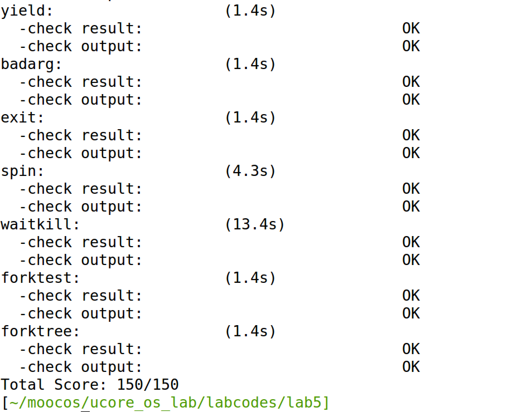

## Lab5 实验报告

### 练习0 填写已有实验

本实验依赖Lab1，Lab2，Lab3，Lab4。将Lab1，Lab2，Lab3中自己所写的代码填入本实验中对应部分。

需要注意的是，本次实验与以往不同，为了能够正确执行lab5的测试应用 程序，需对已完成的实验1/2/3/4的代码进行进一步改进。本部分我根据代码框架中的提示，再结合参考piazza中的讨论和答案的实现，进行了如下改动：

* 针对trap.c文件的修改：在Lab1中已经设置了系统调用的门，所以无需更改idt_init函数；针对trap_dispatch函数，每一个TICK_NUM周期应该设置当前进程需要调度标记为1，表明当前进程需要呗重新调度。同时参考piazza中讨论，为了确保make grade能够正常运行，需要注释掉print_ticks()这行代码。
* 针对proc.c文件的修改：针对alloc_proc()函数在Lab5中proc_struct结构体新增了新的成员变量需要初始化，因此在原有基础上增加对这些变量的初始化即可。针对do_fork()函数原有的第1步（将设置子进程parent指向当前进程，确保当前进程的wait_state字段为0），第5步需要进行修改。

### 练习1 加载应用程序并执行

* 设计实现

  do_execv函数调用load_icode来加载并解析一个处于内存中的ELF执行文件格式的应用程序，建立相应的用户内存空间来放置应用程序的代码段、数据段等，且要设置好proc_struct结构中的成员变量trapframe中的内容，确保在执行此进程后，能够从应用程序设定的起始执行地址开始执行。需设置正确的trapframe内容，如何设置在原有框架中已经有很好的描述，如下：

  *  tf_cs should be USER_CS segment (see memlayout.h)
  * tf_ds=tf_es=tf_ss should be USER_DS segment
  * tf_esp should be the top addr of user stack (USTACKTOP)
  * tf_eip should be the entry point of this binary program (elf->e_entry)
  * tf_eflags should be set to enable computer to produce Interrupt

  按照以上伪代码，具体实现如下，非常简单：

  ```c
  tf->tf_cs = USER_CS;
  tf->tf_ds = USER_DS;
  tf->tf_es = USER_DS;
  tf->tf_ss = USER_DS;
  tf->tf_esp = USTACKTOP;
  tf->tf_eip = elf->e_entry;
  tf->tf_eflags = FL_IF;
  ```

* 请在实验报告中描述当创建一个用户态进程并加载了应用程序后，CPU是如何让这个应用程序最终在用户态执行起来的。即这个用户态进程被ucore选择占用CPU执行（RUNNING态） 到具体执行应用程序第一条指令的整个经过。

  当一个用户态进程并加载了应用程序后

  * proc_run函数会被调用，将此进程标记为运行状态（Running态），加载该进程的栈和页表，并且调用switch_to函数来切换上下文，具体关键代码如下。

    ```c
    current = proc; //将此进程标记为运行状态（Running态）
    load_esp0(next->kstack + KSTACKSIZE); // 加载该进程的内核栈
    lcr3(next->cr3); // 加载页表
    switch_to(&(prev->context), &(next->context)); // 调用switch_to函数，切换上下文
    ```

  * switch_to函数执行完毕后，程序跳到了forkrets处，forkrets函数首先把esp指向当前进程的中断帧，进而跳转到__trapret处。

  * 从_trapret开始执行到iret前，esp 指向了current->tf.tf_eip，而如果此时执行的是initproc，则current->tf.tf_eip=kernel_thread_entry，initproc->tf.tf_cs = KERNEL_CS，所以当执行完iret后，就开 始在内核中执行kernel_thread_entry函数了，而initproc->tf.tf_regs.reg_ebx = init_main，所以 在kernl_thread_entry中执行“call %ebx”后，就开始执行initproc的主体了。Initprocde的主体函 数很简单就是输出一段字符串，然后就返回到kernel_tread_entry函数，并进一步调用do_exit 执行退出操作了。


### 练习2 父进程复制自己的内存空间给子进程

* 设计实现

  创建子进程的函数do_fork在执行中将拷贝当前进程（即父进程）的用户内存地址空间中的合 法内容到新进程中（子进程），完成内存资源的复制。具体是通过copy_range函数（位于 kern/mm/pmm.c中）实现的。具体实现，根据原有框架中给出的详细伪代码实现即可，伪代码如下：

  * find src_kvaddr: the kernel virtual address of page
  * find dst_kvaddr: the kernel virtual address of npage
  * memory copy from src_kvaddr to dst_kvaddr, size is PGSIZE
  * build the map of phy addr of  nage with the linear addr start

  按照以上伪代码，具体实现如下，非常简单：

  ```c
  uintptr_t src_kvaddr = page2kva(page);
  uintptr_t dst_kvaddr = page2kva(npage);
  memcpy(dst_kvaddr, src_kvaddr, PGSIZE);
  page_insert(to, npage, start, perm);
  ```

* 请在实验报告中简要说明如何设计实现”Copy on Write 机制“，给出概要设计，鼓励给出详细设计。

  > Copy-on-write（简称COW）的基本概念是指如果有多个使用者对一个资源A（比如内存 块）进行读操作，则每个使用者只需获得一个指向同一个资源A的指针，就可以该资源 了。若某使用者需要对这个资源A进行写操作，系统会对该资源进行拷贝操作，从而使得 该“写操作”使用者获得一个该资源A的“私有”拷贝—资源B，可对资源B进行写操作。该“写 操作”使用者对资源B的改变对于其他的使用者而言是不可见的，因为其他使用者看到的 还是资源A。

### 练习3 阅读分析源代码，理解进程执行 fork/exec/wait/exit 的实现，以及系统调用的实现

* 对 fork/exec/wait/exit函数以及系统调用的分析：

  * fork：通过系统调用sys_fork来进一步调用do_fork函数创建进程（包括进程控制块、内核栈、虚实内存映射关系等）并将其初始化，在do_fork函数创建好一个新的进程之后，即调用wakeup_proc函数来唤醒新创建好的进程，此时，新创建好的进程进入了就绪态。
  * exec：通过系统调用sys_exec来进一步调用do_execve函数，在do_execve函数中，会先调用exit_mmap(mm)&put_pgdir(mm)来释放内存空间，并调用load_icode函数来创建新的内存空间。
  * wait：通过系统调用sys_wait来进一步调用do_wait函数，在do_wait函数中，包含对父进程和子进程的处理，根据父进程和子进程的不同来进行不同的反应，从而实现wait这一个系统调用。
  * exit：通过系统调用sys_exit来进一步调用do_exit函数，在do_exit函数中，通过调用 exit_mmap & put_pgdir & mm_destroy函数来释放几乎所有进程的内存，将当前进程置为僵尸状态，并唤醒其父进程。最后调用scheduler函数来进行调度，切换到其他进程。
  * 系统调用：上述四个函数的实现都是通过系统调用来实现的，主要实现就是通过不同的系统调用号来调用不同的系统调用，在此不再赘述。

* 请分析fork/exec/wait/exit在实现中是如何影响进程的执行状态的？

  答：在上面的叙述中，已经详细阐述了fork/exec/wait/exit的实现及其对进程执行状态的影响，更为具体的从实现的角度来看，每一个函数的修改进程执行状态，都是通过修改当前进程的proc->state这一成员变量来实现的。

* 请给出ucore中一个用户态进程的执行状态生命周期图（包执行状态，执行状态之间的变 换关系，以及产生变换的事件或函数调用）。（字符方式画即可）

  如下图所示：

  

### 最终实验结果

* make grade结果

  

  


### 本人实现与参考答案的区别

* 练习1：和答案基本相同，具体语法的使用有微小差异。
* 练习2：答案使用了void*,我使用的是uintptr_t，这里我不是很清楚为什么要用void\*。
* 练习3:无参考答案。

### 有关OS原理课的知识点

* 练习1: 进程状态、进程控制、用户进程、ELF文件格式
* 练习2：fork的具体实现
* 练习3:  系统调用的实现、进程状态切换、进程生命周期
* 本实验尚未涉及的OS原理课的重要知识点：没有考察“挂起进程模型”，以及对除fork之外的进程控制接口考察不够深入