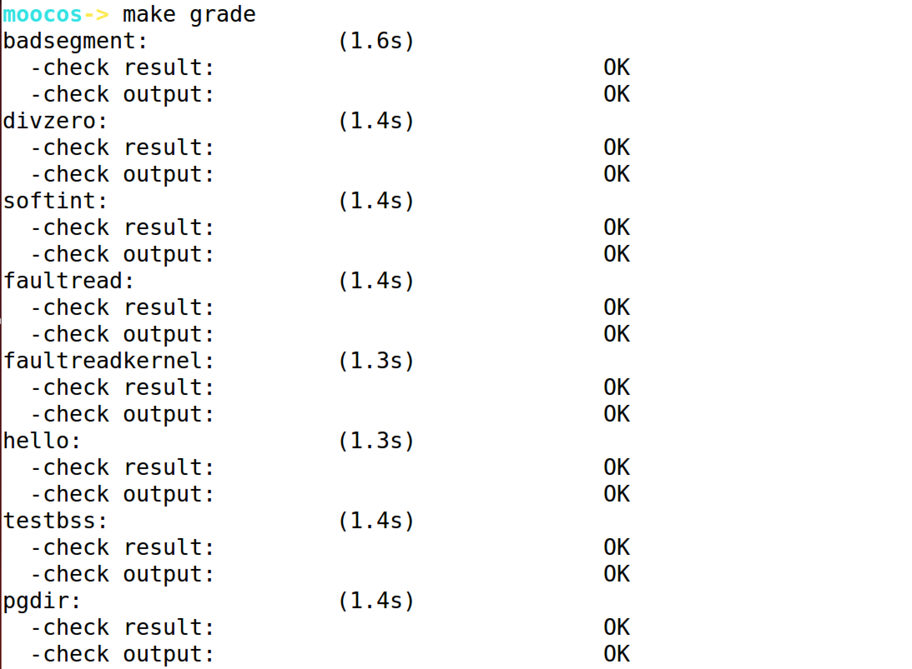
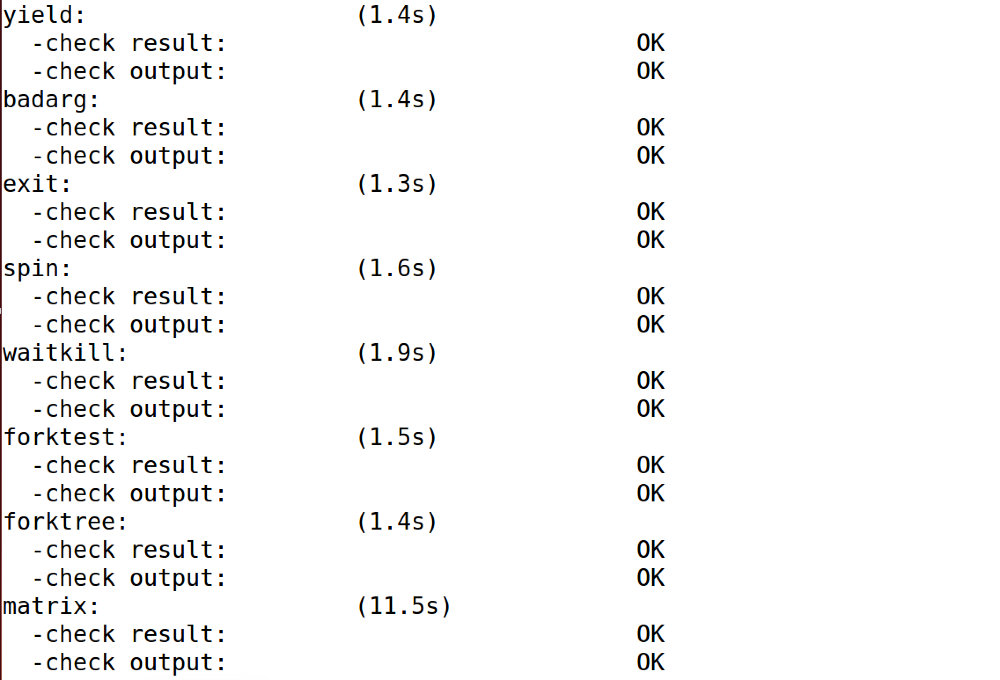
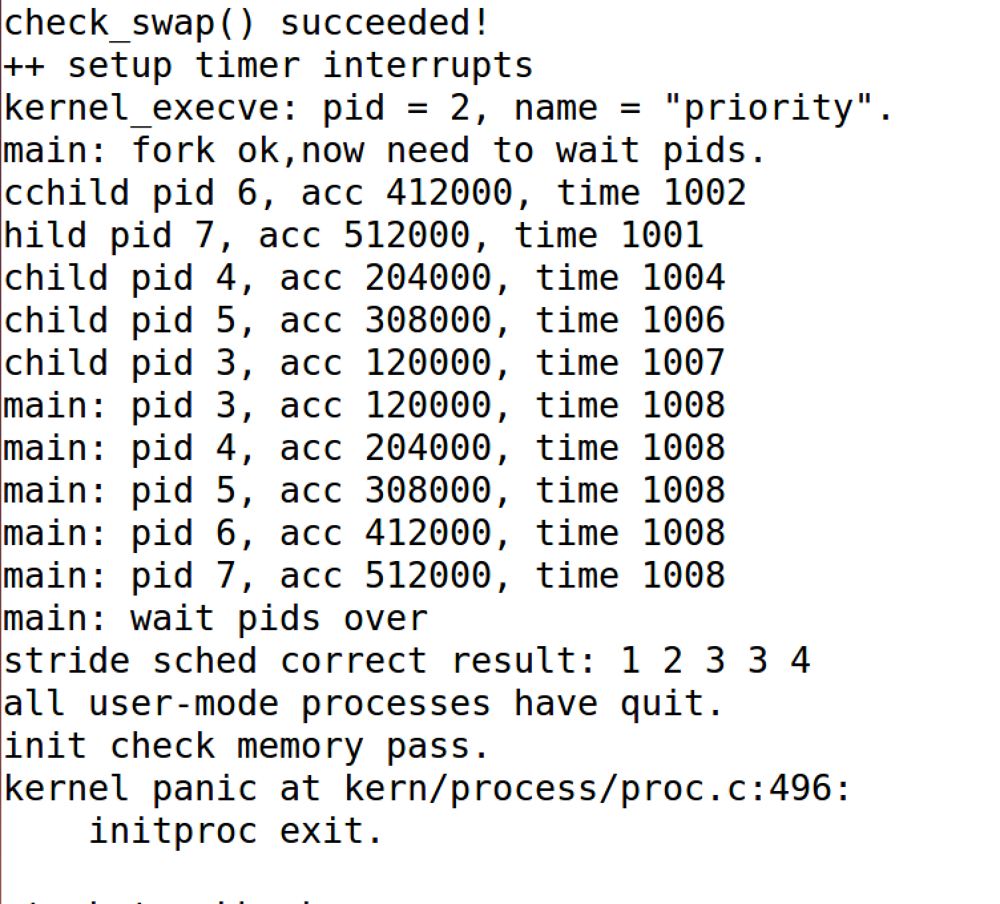

## Lab6 实验报告

### 练习0 填写已有实验

本实验依赖Lab1，Lab2，Lab3，Lab4，Lab5。将Lab1，Lab2，Lab3，Lab4，Lab5中自己所写的代码填入本实验中对应部分。

需要注意的是，本次实验与以往不同，为了能够正确执行lab6的测试应用 程序，需对已完成的实验1/2/3/4/5的代码进行进一步改进。本部分我根据代码框架中的提示，再结合参考piazza中的讨论和答案的实现，进行了如下改动：

* 针对trap.c文件的修改：按照原有框架中注释的提醒，在Lab6中由于实现了进程调度的时间片机制，每个tick周期都需要调用重要的函数sched_class_proc_tick来修改时间片
* 针对proc.c文件的修改：在Lab6中，proc_struct新增了一系列新的成员变量需要进行初始化，因此在alloc_proc函数分别对其进行了初始化。

### 练习1 使用Round Robin算法

* 比较个人完成的lab5和练习0完成后的刚修改的lab6之间的区别

  与lab5相比，lab6专门需要针对处理器调度框架和各种算法进行设计和实现，为此对ucore的调度部分进行了适当的修改，，使得kern/schedule/sched.c 只实现调度器框架，而不再涉及具体的调度算法实现。而RR调度算法在单独的文件（default_sched.c）中实现。

  RR调度算法的调度思想 是让所有runnable态的进程分时轮流使用CPU时间。RR调度器维护当前runnable进程的有序运行队列。当前进程的时间片用完之后，调度器将当前进程放置到运 行队列的尾部，再从其头部取出进程进行调度。RR调度算法的就绪队列在组织结构上也是一 个双向链表，只是增加了一个成员变量，表明在此就绪进程队列中的最大执行时间片。而且 在进程控制块proc_struct中增加了一个成员变量time_slice，用来记录进程当前的可运行时间 片段。这是由于RR调度算法需要考虑执行进程的运行时间不能太长。在每个timer到时的时 候，操作系统会递减当前执行进程的time_slice，当time_slice为0时，就意味着这个进程运行 了一段时间（这个时间片段称为进程的时间片），需要把CPU让给其他进程执行，于是操作 系统就需要让此进程重新回到rq的队列尾，且重置此进程的时间片为就绪队列的成员变量最大 时间片max_time_slice值，然后再从rq的队列头取出一个新的进程执行。

  更为细致细节的部分体现在default_sched.c中的函数实现：

  * 初始化过程函数RR_init：初始化算法维护的所有数据结构的所有的成员变量。
  * 入队列函数RR_enqueue：即把某进程的进程控制块指针放入到rq队列末尾，，且如 果进程控制块的时间片为0，则需要把它重置为rq成员变量max_time_slice。这表示如果进程 在当前的执行时间片已经用完，需要等到下一次有机会运行时，才能再执行一段时间。
  * 出队列函数RR_dequeue：即把就绪进程队列rq的进程控制块指针的队列元素删 除，并把表示就绪进程个数的proc_num减一。
  * 队列选择函数RR_pick_next：即选取就绪进程队列rq中的队头队列元素，并把队列 元素转换成进程控制块指针。
  * 进程更新函数RR_proc_tick：即每次timer到时后，trap函数将会间接调用此函数来 把当前执行进程的时间片time_slice减一。如果time_slice降到零，则设置此进程成员变量 need_resched标识为1，这样在下一次中断来后执行trap函数时，会由于当前进程程成员变量 need_resched标识为1而执行schedule函数，从而把当前执行进程放回就绪队列末尾，而从就 绪队列头取出在就绪队列上等待时间最久的那个就绪进程执行。

* 请理解并分析sched_class中各个函数指针的用法，并结合Round Robin 调度算法描 ucore的调度执行过程

  更为详细的分析在上文中已经提及，在此不再赘述，sched_class中各个函数指针如下：

  * void (*init)(struct run_queue *rq)：初始化过程函数，初始化调度器的相关数据结构。
  * void (*enqueue)(struct run_queue *rq, struct proc_struct *proc)：入队列函数，将进程放入调度器队列。
  * void (*dequeue)(struct run_queue *rq, struct proc_struct *proc)：出队列函数，从调度器队列中移出一个进程。
  * struct proc_struct *(*pick_next)(struct run_queue *rq)：队列选择函数，根据当前调度器策略算法选择下一个进程。
  * void (*proc_tick)(struct run_queue *rq, struct proc_struct *proc)：进程更新函数，每次时钟中断之后更新进程的信息。

* 请在实验报告中简要说明如何设计实现”多级反馈队列调度算法“，给出概要设计，鼓励给 出详细设计

  在多级反馈队列调度算法中，就绪队列被划分为多个独立的子队列，每个队列拥有自己的调度策略。进程可以在不同队列之间移动的多级队列算法。根据这一原则，基于上述接口进行设计即可：

  * init：初始化多级反馈队列调度算法维护的相关数据结构的相关成员变量。
  * enqueue：根据要进队列的进程的时间片的不同来进行不同的操作，若当前进程的时间片为0，则不改变其优先级加入相应优先级的队列中；若当前进程的时间片不为0，则将此进程的优先级降低一级加入相应优先级的队列中。
  * dequeue：从相应优先级的队列中将此进程取出。
  * pick_next：先选择合适的优先级，然后从相应优先级的队列中取出一个进程返回。
  * proc_tick：基于时间片调度，因此与RR算法的实现基本一样。


### 练习2 实现 Stride Scheduling 调度算法

* 设计实现

  首先需要换掉RR调度器的实现，即用default_sched_stride_c覆盖default_sched.c。然后根据 此文件和后续文档对Stride度器的相关描述，完成Stride调度算法的实现。

  考虑更为细节的实现，Stride Scheduling调度算法和Round Robin算法的不同之处在于每一次选择的进程是当前所有进程中stride值最小的那一个。按照学堂在线中的讲解，我决定选用斜堆来实现Stride Scheduling调度算法。再进一步，就是按照default_sched_stride_c中的代码注释，对调度框架中每一个接口按照Stride Scheduling调度算法来实现即可，其中有一个很重要的部分就是对BIG_STRIDE取值的证明，这一点本文将进行叙述。

  * BIG_STRIDE的选择：0x7fffffff

    令PASS_MAX为当前所有进程里最大的步进值。对于每次Stride调度器的调度步骤中，有其最大的步进值STRIDE_MAX和最小的步进值STRIDE_MIN，有STRIDE_MAX - STRIDE_MIN <= PASS_MAX。按照学堂在线中的讲解，PASS可以理解为行走中每一步的步长，STRIDE可以理解为行走的距离。非形式化地理解我们可以用“反证法”来证明，在一次调度的过程中，最大的步进值和最小的步进值的差值必定会小于最大的步进值，否则这个最小的步进值必定会连续两次被调度到，这与“一次调度”的假设产生了矛盾，因此结论得证。形式化地证明可以通过数学归纳法来证明，在此就不再赘述。为了使两个进程的stride值相减之后的值不存在溢出的情况，在ucore中，因为每一个进程的stride值都是uint32类型的，即无符号的32位整数的，因此，BIG_STRIDE应该选择无符号32位整数的最大范围0x7fffffff。

  * stride_init：初始化斜堆数据结构即可，清零进程个数计数器。

    ```c
    list_init(&rq->run_list);
    rq->lab6_run_pool = NULL;
    rq->proc_num = 0;
    ```

  * stride_enqueue：入队函数，调用 skew_heap_insert将新的进程按照stride的大小插入斜堆中即可，并且最后要更新进程总数。

    ```c
    rq->lab6_run_pool = skew_heap_insert(rq->lab6_run_pool, &proc->lab6_run_pool, proc_stride_comp_f);
    // 如果进程的时间片用完，或者进程的时间片溢出了
    if (proc->time_slice == 0 || proc->time_slice > rq->max_time_slice) {
        proc->time_slice = rq->max_time_slice;
    }
    proc->rq = rq;
    rq->proc_num = rq->proc_num + 1;
    ```

  * stride_dequeue：出队函数，调用skew_heap_remove将进程从斜堆中调出即可，并且最后要更新进程总数。

    ```c
    rq->lab6_run_pool = skew_heap_remove(rq->lab6_run_pool, &proc->lab6_run_pool, proc_stride_comp_f);
    rq->proc_num = rq->proc_num - 1;
    ```

  * stride_pick_next：选择最小stride的进程，并更新stride值即可。

    ```c
    // Return NULL if there is no process in the queue.
    if(rq->lab6_run_pool == NULL) {
        return NULL;
    }
    //get a  proc_struct pointer p  with the minimum value of stride
    struct proc_struct *proc = le2proc(rq->lab6_run_pool, lab6_run_pool);
    //update p;s stride value: p->lab6_stride
    proc->lab6_stride = proc->lab6_stride + BIG_STRIDE / proc->lab6_priority;
    return proc;
    ```

  * stride_proc_tick：与RR算法一致，无需改变。在此不再赘述。

### 最终实验结果

* make grade结果

  

  

  

* make run-priority结果

  


### 本人实现与参考答案的区别

* 练习1：无需编码。
* 练习2：只选择了skew_heap的数据结构，参考答案利用宏实现了优先队列的方式

### 有关OS原理课的知识点

* 练习1:进程调度，进程管理，RR调度算法
* 练习2：Stride调度算法
* 本实验尚未涉及的OS原理课的重要知识点：优先级反置、实时调度和多处理器调度