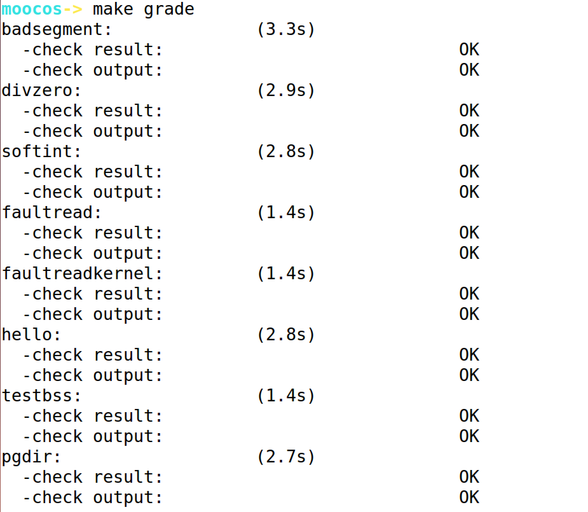

## Lab7 实验报告

### 练习0 填写已有实验

本实验依赖Lab1，Lab2，Lab3，Lab4，Lab5，Lab6。将Lab1，Lab2，Lab3，Lab4，Lab5，Lab6中自己所写的代码填入本实验中对应部分。

需要注意的是，本次实验与以往不同，为了能够正确执行lab7的测试应用 程序，需对已完成的实验1/2/3/4/5/6的代码进行进一步改进。本部分我根据代码框架中的提示，再结合参考piazza中的讨论和答案的实现，进行了如下改动：

* 针对trap.c文件的修改：按照原有框架中注释的提醒，在Lab7中由于实现了timer机制，需要调度者更新并检查是否时间到期，如到期，唤醒进程。通过调用run_timer_list()即可。

### 练习1 理解内核级信号量的实现和基于内核级信号量的哲学家就餐问题

* 比较个人完成的Lab6和练习0完成后的刚修改的Lab7之间的区别

  Lab7设计实现了多种同步互斥手段，包括时钟中断管理、等待队列、信号量、管程机制 （包含条件变量设计）等，并基于信号量实现了哲学家问题的执行过程。而本次实验的练习是要求用管程机制实现哲学家问题的执行过程。在实现信号量机制和管程机制时，需要让无法进入临界区的进程睡眠，为此在ucore中设计了等待队列wait_queue。当进程无法进入临界区（即无法获得信号量）时，可让进程进入等待队列，这时的进程处于等待状态（也可称为 阻塞状态），从而会让Lab6中的调度器选择一个处于就绪状态（即RUNNABLE STATE）的进程，进行进程切换，让新进程有机会占用CPU执行，从而让整个系统的运行更加高效。

  在lab7中的ucore初始化过程，开始的执行流程都与lab6相同，直到执行到创建第二个内核线程init_main时，修改了init_main的具体执行内容，即增加了check_sync函数的调用，而位于kern/sync/check_sync.c中的check_sync函数可以理解为是Lab7的起始执行点，是Lab7的总控函数。进一步分析此函数，可以看到这个函数主要分为了两个部分，第一部分是实现基于信号量的哲学家问题，第二部分是实现基于管程的哲学家问题。

* 请在实验报告中给出内核级信号量的设计描述，并说明其大致执行流程。

  信号量是一种同步互斥机制的实现，普遍存在于现在的各种操作系统内核里。相对于spinlock的应用对象，信号量的应用对象是在临界区中运行的时间较长的进程。等待信号量的进程需要睡眠来减少占用 CPU 的开销。基于上诉信号量实现可以认为，当多个进程可以进行互斥或同步合作时，一个进程会由于无法满足信号量设置的某条件而在某一位置停止，直到它接收到一个特定的信号（表明条件满足了）。为了发信号，需要使用一个称作信号量的特殊变量。为通过信号量s传送信号，信号量的V操作采用进程可执行原语semSignal(s)；为通过信号量s接收信号，信号量的P 操作采用进程可执行原语semWait(s)；如果相应的信号仍然没有发送，则进程被阻塞或睡眠，直到发送完为止。

  ucore中信号量参照上述原理描述，建立在开关中断机制和wait_queue的基础上进行了具体实现。信号量的数据结构定义如下：

  ```c
  typedef struct {
  	int value;//信号量的当前值
  	wait_queue_t wait_queue;//信号量对应的等待队列
  } semaphore_t;
  ```

  semaphore_t是最基本的记录型信号量（record semaphore)结构，包含了用于计数的整数值 value，和一个进程等待队列wait_queue，一个等待的进程会挂在此等待队列上。

  在ucore中最重要的信号量操作是P操作函数down(semaphore_t *sem)和V操作函数 up(semaphore_t *sem)。但这两个函数的具体实现是__down(semaphore_t *sem, uint32_t wait_state) 函数和__up(semaphore_t *sem, uint32_t wait_state)函数，二者的具体实现描述如下：

  __down(semaphore_t *sem, uint32_t wait_state, timer_t *timer)：具体实现信号量的P操作，首先关掉中断，然后判断当前信号量的value是否大于0。如果是>0，则表明可以获得信号量，故让value减一，并打开中断返回即可；如果不是>0，则表明无法获得信号量，故需要将当前的进程加入到等待队列中，并打开中断，然后运行调度器选择另外一个进程执行。如果被V操作唤醒，则把自身关联的wait从等待队列中删除（此过程需要先关中断，完成后开中断）。具体实现如下所示：

  ```c
  static __noinline uint32_t __down(semaphore_t *sem, uint32_t wait_state) {
  	bool intr_flag;
  	local_intr_save(intr_flag);
      if (sem->value > 0) {
          sem->value --;
          local_intr_restore(intr_flag);
          return 0;
      }
      wait_t __wait, *wait = &__wait;
      wait_current_set(&(sem->wait_queue), wait, wait_state);
      local_intr_restore(intr_flag);
      schedule();
      local_intr_save(intr_flag);
      wait_current_del(&(sem->wait_queue), wait);
      local_intr_restore(intr_flag);
      if (wait->wakeup_flags != wait_state) {
      	return wait->wakeup_flags;
      }
      return 0;
  }
  ```

  __up(semaphore_t *sem, uint32_t wait_state)：具体实现信号量的V操作，首先关中断，如果信号量对应的wait queue中没有进程在等待，直接把信号量的value加一，然后开中断返回；如果有进程在等待且进程等待的原因是semophore设置的，则调用wakeup_wait函数将 waitqueue中等待的第一个wait删除，且把此wait关联的进程唤醒，最后开中断返回。具体实现如下所示：

  ```c
  static __noinline void __up(semaphore_t *sem, uint32_t wait_state) {
      bool intr_flag;
      local_intr_save(intr_flag);
      {
          wait_t *wait;
          if ((wait = wait_queue_first(&(sem->wait_queue))) == NULL) {
          	sem->value ++;
          }
          else {
          	wakeup_wait(&(sem->wait_queue), wait, wait_state, 1);
          }
      }
      local_intr_restore(intr_flag);
  }
  ```

* 请在实验报告中给出给用户态进程/线程提供信号量机制的设计方案，并比较说明给内核级提供信号量机制的异同。

  由于现在是在给用户态进程/线程提供信号量机制的设计方案，所以显然是要将各种函数结构封装成系统调用的API的。最大的不同就是系统调用层面的实现，其余的实现大致思路于内核态进程/线程的信号量机制大致类似，甚至可以直接复用内核态进程/线程的信号量机制的up/down操作，将其封装为系统调用接口即可。除此之外，还需要为用户态进程/线程提供信号量init初始化的系统调用接口，用来初始化信号量中各种成员变量。

  * 异：最大的不同就是用户态的信号量需要通过系统调用来实现。同时，由于用户态中的进程涉及一些进程切换、原子指令相关的指令是无法在用户态下实现的，这些仍然需要在内核态来实现。因此，还需要给用户态增加“向内核申请信号量、释放一个信号量给内核态“的系统调用。
  * 同：大致的实现思路、算法、数据结构是相同的。

### 练习2 完成内核级条件变量和基于内核级条件变量的哲学家就餐问题

* 设计实现

  原有框架中已经给出了很详细的伪代码注释，根据伪代码注释编程即可，内核级条件变量的wait_cv和signal_cv代码实现如下：

  ```c
  if(cvp->count > 0) { //if(cv.count>0)
      cvp->owner->next_count = cvp->owner->next_count + 1; // mt.next_count ++;
      up(&(cvp->sem)); //signal(cv.sem);
      down(&(cvp->owner->next));//wait(mt.next);
      cvp->owner->next_count = cvp->owner->next_count - 1; //mt.next_count--;
  }
  ```

  ```c
  cvp->count = cvp->count + 1;//cv.count ++;
  if(cvp->owner->next_count > 0) {//if(mt.next_count>0)
      up(&(cvp->owner->next));//signal(mt.next)
  } else {                    
      up(&(cvp->owner->mutex));//signal(mt.mutex);
  }
  down(&(cvp->sem));//wait(cv.sem);
  cvp->count = cvp->count - 1;//cv.count --;
  ```

  基于内核级条件变量的哲学家就餐问题原有框架中也给出了很详细的伪代码，同时参考本来就有的基于信号量的哲学家就餐问题的实现编程即可，具体代码实现如下：

  ```c
  state_condvar[i] = HUNGRY;/* 记录下哲学家i饥饿的事实 */
  phi_test_condvar(i);/* 试图得到两只叉子 */
  if(state_condvar[i] != EATING) {
      cprintf("phi_take_forks_condvar: state_condvar[%d] will wait\n",i);
      cond_signal(&mtp->cv[i]);
  }
  ```

  ```c
  state_condvar[i] = THINKING;/* 哲学家进餐结束 */
  phi_test_condvar(LEFT);/* 看一下左邻居现在是否能进餐 */
  phi_test_condvar(RIGHT);/* 看一下右邻居现在是否能进餐 */
  ```

* 请在实验报告中给出内核级条件变量的设计描述，并说明其大致执行流程。

  在单处理器情况下，将会导致所有其它进程都无法进入临界区使得该条件Cond为真，该管程的执行将会发生死锁。为此，可引入条件变量（Condition Variables，简称CV）。一个条件变量CV可理解为一个进程的等待队列，队列中的进程正等待某个条件Cond变为真。每个条件变量关联着一个条件，如果条件Cond不为真，则进程需要等待，如果条件Cond为真，则进程可以进一步在管程中执行。需要注意当一个进程等待一个条件变量CV（即等待Cond为真），该进程需要退出管程，这样才能让其它进程可以进入该管程执行，并进行相关操作，比如设置条件Cond为真，改变条件变量的状态，并唤醒等待在此条件变量CV上的进程。因此对条件变量CV有两种主要操作：

  * wait_cv： 被一个进程调用，以等待断言Pc被满足后该进程可恢复执行. 进程挂在该条件变量上等待时，不被认为是占用了管程。

    ```c
    cv.count++;
    if(monitor.next_count > 0)
    	sem_signal(monitor.next);
    else
    	sem_signal(monitor.mutex);
    sem_wait(cv.sem);
    cv.count -- ;
    ```

  * signal_cv：被一个进程调用，以指出断言Pc现在为真，从而唤醒等待断言Pc被满足的进程继续执行。

    ```c
    if( cv.count > 0) {
        monitor.next_count ++;
        sem_signal(cv.sem);
        sem_wait(monitor.next);
        monitor.next_count -- ;
    }
    ```

  ucore中的管程是基于信号量和条件变量来实现的。管程中的成员变量mutex是一个二值信号量，是实现每次只允许一个进程进入管程的关键元 素，确保了互斥访问性质。管程中的条件变量cv通过执行 wait_cv ，会使得等待某个条件 Cond为真的进程能够离开管程并睡眠，且让其他进程进入管程继续执行；而进入管程的某进 程设置条件Cond为真并执行 signal_cv 时，能够让等待某个条件Cond为真的睡眠进程被唤 醒，从而继续进入管程中执行。

  管程中的条件变量的数据结构condvar_t定义如下：

  ```c
  typedef struct condvar{
      semaphore_t sem;// the sem semaphore is used to down the waiting proc, and the signaling proc should up the waiting proc
      int count;// the number of waiters on condvar
      monitor_t * owner;// the owner(monitor) of this condvar
  } condvar_t;
  ```

  条件变量的定义中也包含了一系列的成员变量，信号量sem用于让发出 wait_cv 操作的等待某 个条件Cond为真的进程睡眠，而让发出 signal_cv 操作的进程通过这个sem来唤醒睡眠的进 程。count表示等在这个条件变量上的睡眠进程的个数。owner表示此条件变量的宿主是哪个管程。

* 请在实验报告中给出给用户态进程/线程提供条件变量机制的设计方案，并比较说明给内核级提供条件变量机制的异同。

  与练习1中相似的，这里需要给出用户态条件变量的设计思路与方案，与练习1中一样，要实现用户态的条件变量，可以直接复用内核态的条件变量的相关实现，唯一需要注意的就是需要给用户态提供信号量操作的系统调用接口，通过系统调用的实现来进入内核态，完成对信号量的操作。

  * 异：最大的不同就是用户态的条件变量需要通过系统调用来实现。理由同练习1.
  * 同：大致的实现思路、算法、数据结构是相同的。

* 请在实验报告中回答：能否不用基于信号量机制来完成条件变量？如果不能，请给出理由， 如果能，请给出设计说明和具体实现。

  我认为，是可以不基于信号量机制来完成条件变量的。从本质上来说，条件变量可理解为一个进程的等待队列，队列中的进程正等待某个条件Cond变为真。因此，我认为可以借用ucore系统中原生自带的等待队列来实现条件变量，但这样一来就需要额外的“锁机制”来实现互斥访问。通过锁机制中signal、wait等原本需要调用up、down等操作的地方改为与管程有关的实现来代替。这样就可以实现等待队列所缺失的互斥访问属性了。

### 最终实验结果

* make grade结果

  

  

  

* make run-matrix结果(截屏过于冗长，在此不再赘述)

### 本人实现与参考答案的区别

* 练习1：无需编码。
* 练习2：由于原有框架中已经给出了很详细的伪代码描述，并且辅以详细的实验指导书的讲解，因此与参考答案实现区别不大。

### 有关OS原理课的知识点

* 练习1:信号量机制
* 练习2:管程及其条件变量机制、同步互斥、哲学家就餐问题的解决
* 本实验尚未涉及的OS原理课的重要知识点：读者-写者问题、生产者-消费者问题、死锁的解决办法