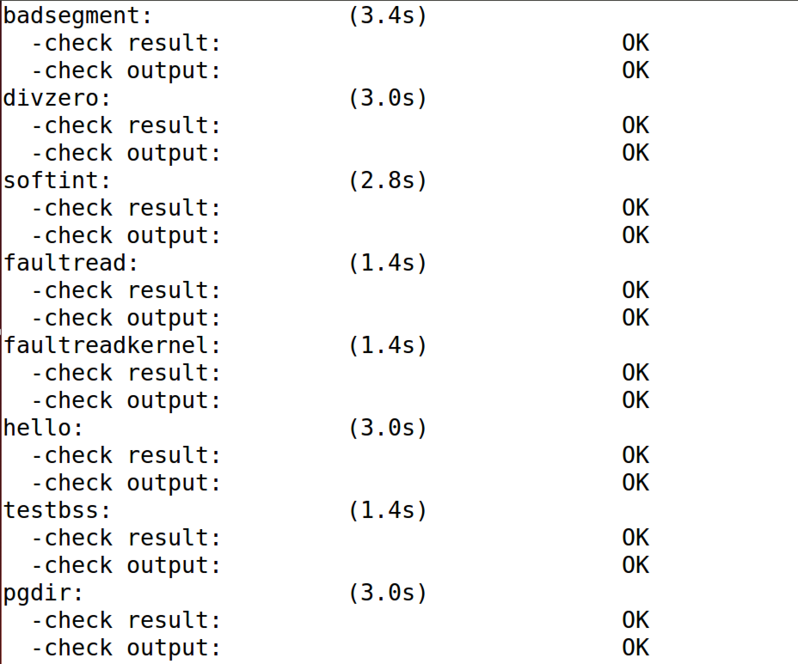
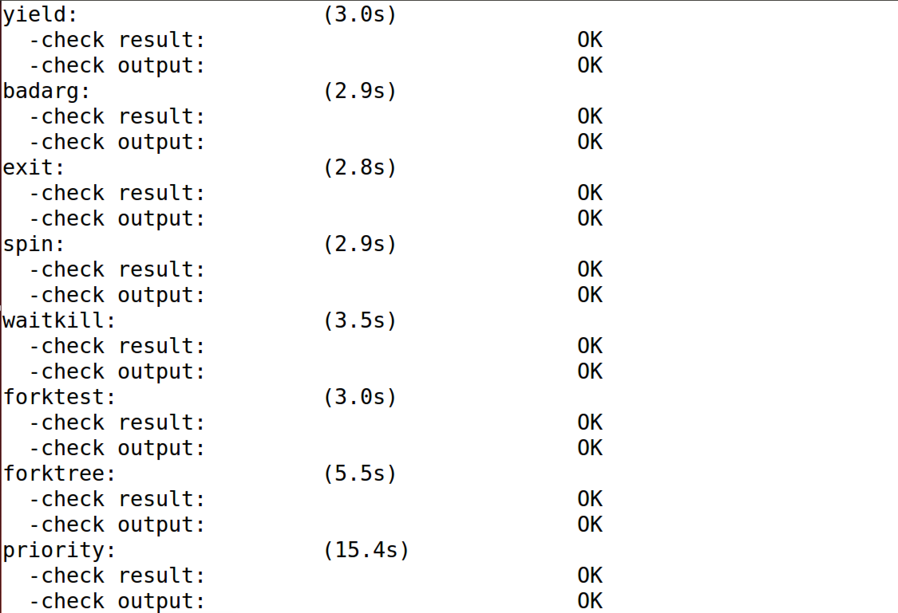
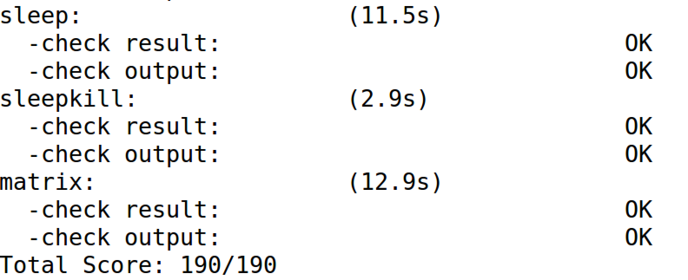
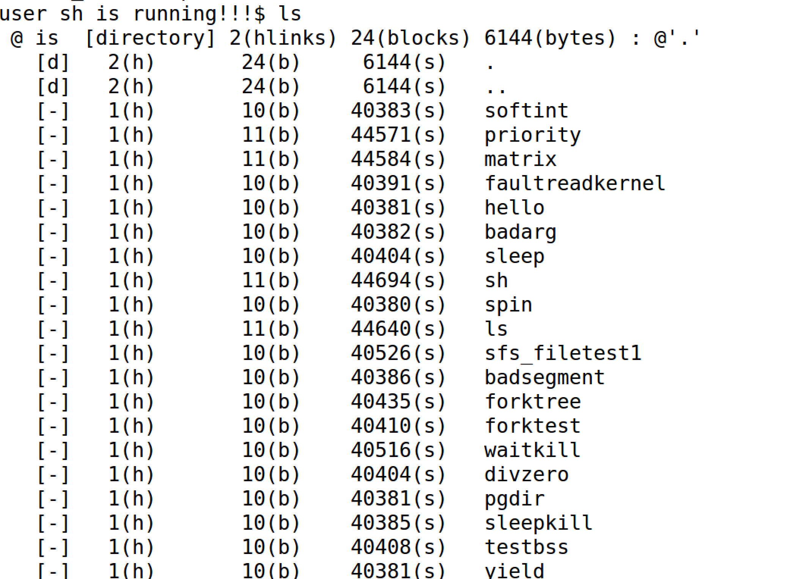

## Lab8 实验报告

### 练习0 填写已有实验

本实验依赖Lab1，Lab2，Lab3，Lab4，Lab5，Lab6，Lab7。将Lab1，Lab2，Lab3，Lab4，Lab5，Lab6，Lab7中自己所写的代码填入本实验中对应部分。

需要注意的是，本次实验与以往不同，为了能够正确执行lab8的测试应用 程序，需对已完成的实验1/2/3/4/5/6/7的代码进行进一步改进。本部分我根据代码框架中的提示，再结合参考piazza中的讨论和答案的实现，进行了如下改动：

* 针对proc.c文件的修改：按照原有框架中注释的提醒，在Lab8中由于加入了文件框架，因此在proc.c文件中的alloc_proc() 初始化过程中要加入初始化自己的文件信息的过程。即对 proc->filesp 成员变量的初始化。
* 针对proc.c文件的修改：由于在Lab8中实现了文件系统，在进程复制的过程中，子进程需要复制父进程中的文件信息，因此在do_fork函数中直接调用框架中copy_files()函数即可，此外还需要增加对文件复制错误情况的处理。

### 练习1 完成读文件操作的实现

* 设计实现

  在本练习中主要是针对sfs_inode.c文件中的sfs_io_nolock函数的读文件过程的实现。从整个文件系统框架的调用角度来看，sfs_read函数调用sfs_io函数。它有三个参数，node是对应文件的inode，iob是缓存，write表 示是读还是写的布尔值（0表示读，1表示写），这里是0。函数先找到inode对应sfs和sin，然 后调用sfs_io_nolock函数进行读取文件操作，最后调用iobuf_skip函数调整iobuf的指针。在sfs_io_nolock函数中，先计算一些辅助变量，并处理一些特殊情况（比如越界），然后有 sfs_buf_op = sfs_rbuf,sfs_block_op = sfs_rblock，设置读取的函数操作。接着进行实际操 作，先处理起始的没有对齐到块的部分，再以块为单位循环处理中间的部分，最后处理末尾剩余的部分。每部分中都调用sfs_bmap_load_nolock函数得到blkno对应的inode编号，并调 用sfs_rbuf或sfs_rblock函数读取数据（中间部分调用sfs_rblock，起始和末尾部分调用 sfs_rbuf），调整相关变量。完成后如果offset + alen > din->fileinfo.size（写文件时会出现这 种情况，读文件时不会出现这种情况，alen为实际读写的长度），则调整文件大小为offset + alen并设置dirty变量。因此，具体的读文件操作的实现只要针对文件数据块的三部分（头部部分、中间整数据块部分、尾部部分）分别处理即可。具体实现请参看代码实现：

  ```C
  // (1) If offset isn't aligned with the first block, 
  blkoff = offset - blkno * SFS_BLKSIZE;//计算头部偏移
  if (blkoff != 0) {		      //若偏移不为0
  	size = (nblks != 0) ? (SFS_BLKSIZE - blkoff) : (endpos - offset);//计算size		
  	int flagLoad = sfs_bmap_load_nolock(sfs, sin, blkno, &ino);
  	if (flagLoad != 0) {
  		ret = flagLoad;
  		goto out;
  	}
  	int flagBuf = sfs_buf_op(sfs, buf, size, ino, blkoff);
  	if (flagBuf != 0){
  		ret = flagBuf;
  		goto out;
  	}
  	alen = alen + size;
  	buf = buf + size;
  	if(nblks != 0){
  		blkno = blkno + 1;
  		nblks = nblks - 1;
  	} else {
  		goto out;
  	}
  }
  // (2) Rd/Wr aligned blocks 
  for(nblks; nblks != 0; nblks--) { //对所有整数据块进行读写
  	int flagLoad = sfs_bmap_load_nolock(sfs, sin, blkno, &ino);
  	if (flagLoad != 0) {
  		ret = flagLoad;
  		goto out;
  	}
  	int flagBlock = sfs_block_op(sfs, buf,  ino, 1);
  	if (flagBlock != 0){
  		ret = flagBlock;
  		goto out;
  	}
  	alen = alen +  SFS_BLKSIZE; //每次读取的大小为一个数据块大小
  	buf = buf + SFS_BLKSIZE;
  	blkno = blkno + 1;
  }
  
  // (3) If end position isn't aligned with the last block,
  size = endpos - (endpos / SFS_BLKSIZE) * SFS_BLKSIZE; // 计算剩余需要读取的size
  if (size != 0) {                                    //若仍然存在还没有读取的部分，一次性读入
  	int flagLoad = sfs_bmap_load_nolock(sfs, sin, blkno, &ino);
  	if (flagLoad != 0) {
  		ret = flagLoad;
  		goto out;
  	}
  	int flagBuf = sfs_buf_op(sfs, buf, size, ino, 0);
  	if (flagBuf != 0){
  		ret = flagBuf;
  		goto out;
  	}
  	alen = alen + size;
  	buf = buf + size;
  }
  ```

* 请在实验报告中给出设计实现”UNIX的PIPE机制“的概要设方案，鼓励给出详细设计方案。

  在UNIX系统中，PIPE本身也是一种特殊的文件，参考STDIN、STDOUT以及SFS的设计，我认为可以将PIPE作为与这三者并列的另一个子系统来实现。更为具体的实现上来说，我认为可以将PIPE文件和其他文件一样映射到某一块内存区域中即可。

  针对PIPE的一些操作，我认为则需要为其单独定制一系列的系统调用，例如创建PIPE（此时需要将这个PIPE与两个已经存在的进程相连接）、向PIPE中写数据、从PIPE中读数据等系统调用。

  更为具体到我们的ucore操作系统架构中来，我认为可以模仿sfs_inode这一数据结构来构造PIPE数据结构，并为其添加上述的系统调用供其使用。除此之外，还需要考虑的一个很重要的问题就是需要考虑对PIPE的互斥访问，因此需要对PIPE使用信号量来实现其同步互斥的功能。


### 练习2 完成基于文件系统的执行程序机制的实现

* 设计实现

  在本练习中主要是针对proc.c文件中的load_icode函数的整体实现。不知道什么原因，在Lab8中load_icode函数的实现从思路上来说与Lab7中相比需要改的并没有太多，但在Lab8中load_icode函数却没有引用原来Lab7框架中的代码，因此我是基于Lab7的load_icode函数的基础来实现的，在此基础上在Lab8相比Lab7的更改做了改进。在Lab8中，可执行文件是elf格式的，主要通过调用load_icode_read函数完成针对elf文件的磁盘读取，因此在load_icode函数中需要基于SFS文件系统对文件进行读取和寻址操作，依次将elfhd，phd以及prog content读入内存。其次，需要我们新实现的地方是，我们需要在一切都load好之后设置命令行参数，设置用户堆栈，将参数寄存器设置为argc和argv的地址。具体实现请看如下代码（Lab8与Lab7不同的地方已经在代码中标出，此外，本实现部分参考了参考答案的实现和piazza上的讨论）：

  ```c
  // for Lab8
  assert(argc <= EXEC_MAX_ARG_NUM && argc >= 0);
  if (current->mm != NULL) {
      panic("load_icode: current->mm must be empty.\n");
  }
  int ret = -E_NO_MEM;
  struct mm_struct *mm;
  //(1) create a new mm for current process
  if ((mm = mm_create()) == NULL) {
      goto bad_mm;
  }
  //(2) create a new PDT, and mm->pgdir= kernel virtual addr of PDT
  if (setup_pgdir(mm) != 0) {
      goto bad_pgdir_cleanup_mm;
  }
  //(3) copy TEXT/DATA section, build BSS parts in binary to memory space of process
  struct Page *page;
  //(3.1) get the file header of the bianry program (ELF format)
  struct elfhdr _elf;
  struct elfhdr *elf = &_elf;
  //(3.2) get the entry of the program section headers of the bianry program (ELF format)
  struct proghdr _ph;
  struct proghdr *ph = &_ph;
  //for LAB8
  int flag_elf = load_icode_read(fd, elf, sizeof(struct elfhdr), 0);
  if(flag_elf != 0) {
      ret = flag_elf;
      goto bad_elf_cleanup_pgdir;
  }
  //(3.3) This program is valid?
  if (elf->e_magic != ELF_MAGIC) {
      ret = -E_INVAL_ELF;
      goto bad_elf_cleanup_pgdir;
  }
  uint32_t vm_flags, perm;
  uint32_t phIndex;
  // struct proghdr *ph_end = ph + elf->e_phnum;
  for (phIndex = 0; phIndex < elf->e_phnum; phIndex ++) {
      //(3.4) find every program section headers
      // for Lab8
      off_t phOffset = elf->e_phoff + sizeof(struct proghdr) * phIndex;
      int flag_ph = load_icode_read(fd, ph, sizeof(struct proghdr), phOffset);
      if(flag_ph != 0) {
          ret = flag_ph;
          goto bad_cleanup_mmap;
      }
      if (ph->p_type != ELF_PT_LOAD) {
          continue ;
      }
      if (ph->p_filesz > ph->p_memsz) {
          ret = -E_INVAL_ELF;
          goto bad_cleanup_mmap;
      }
      if (ph->p_filesz == 0) {
          continue ;
      }
      //(3.5) call mm_map fun to setup the new vma ( ph->p_va, ph->p_memsz)
      vm_flags = 0, perm = PTE_U;
      if (ph->p_flags & ELF_PF_X) vm_flags |= VM_EXEC;
      if (ph->p_flags & ELF_PF_W) vm_flags |= VM_WRITE;
      if (ph->p_flags & ELF_PF_R) vm_flags |= VM_READ;
      if (vm_flags & VM_WRITE) perm |= PTE_W;
      if ((ret = mm_map(mm, ph->p_va, ph->p_memsz, vm_flags, NULL)) != 0) {
          goto bad_cleanup_mmap;
      }
      //unsigned char *from = binary + ph->p_offset;
      size_t off, size;
      uintptr_t start = ph->p_va, end, la = ROUNDDOWN(start, PGSIZE);
      // for Lab8
      off_t ph_Offset = ph->p_offset;
      ret = -E_NO_MEM;
      //(3.6) alloc memory, and  copy the contents of every program section (from, from+end) to process's memory (la, la+end)
      end = ph->p_va + ph->p_filesz;
      //(3.6.1) copy TEXT/DATA section of bianry program
      while (start < end) {
          if ((page = pgdir_alloc_page(mm->pgdir, la, perm)) == NULL) {
              ret = -E_NO_MEM;
              goto bad_cleanup_mmap;
          }
          off = start - la, size = PGSIZE - off, la += PGSIZE;
          if (end < la) {
              size -= la - end;
          }
          // memcpy(page2kva(page) + off, from, size);
          // for Lab8
          int flag_page = load_icode_read(fd, page2kva(page) + off, size, ph_Offset);
          if(flag_page != 0) {
              ret = flag_page;
              goto bad_cleanup_mmap;
          }
          start += size, ph_Offset += size;
      }
      //(3.6.2) build BSS section of binary program
      end = ph->p_va + ph->p_memsz;
      if (start < la) {
          /* ph->p_memsz == ph->p_filesz */
          if (start == end) {
              continue ;
          }
          off = start + PGSIZE - la, size = PGSIZE - off;
          if (end < la) {
              size -= la - end;
          }
          memset(page2kva(page) + off, 0, size);
          start += size;
          assert((end < la && start == end) || (end >= la && start == la));
      }
      while (start < end) {
          if ((page = pgdir_alloc_page(mm->pgdir, la, perm)) == NULL) {
              ret = -E_NO_MEM;
              goto bad_cleanup_mmap;
          }
          off = start - la, size = PGSIZE - off, la += PGSIZE;
          if (end < la) {
              size -= la - end;
          }
          memset(page2kva(page) + off, 0, size);
          start += size;
      }
  }
  //for Lab8
  sysfile_close(fd); // 关闭文件描述符
  //(4) build user stack memory
  vm_flags = VM_READ | VM_WRITE | VM_STACK;
  if ((ret = mm_map(mm, USTACKTOP - USTACKSIZE, USTACKSIZE, vm_flags, NULL)) != 0) {
      goto bad_cleanup_mmap;
  }
  assert(pgdir_alloc_page(mm->pgdir, USTACKTOP-PGSIZE , PTE_USER) != NULL);
  assert(pgdir_alloc_page(mm->pgdir, USTACKTOP-2*PGSIZE , PTE_USER) != NULL);
  assert(pgdir_alloc_page(mm->pgdir, USTACKTOP-3*PGSIZE , PTE_USER) != NULL);
  assert(pgdir_alloc_page(mm->pgdir, USTACKTOP-4*PGSIZE , PTE_USER) != NULL);
  //(5) set current process's mm, sr3, and set CR3 reg = physical addr of Page Directory
  mm_count_inc(mm);
  current->mm = mm;
  current->cr3 = PADDR(mm->pgdir);
  lcr3(PADDR(mm->pgdir));
  // for Lab8 设置命令行参数，设置堆栈
  // setup uargc and uargv in user stacks
  uint32_t i = 0;
  uint32_t argvLen = 0;
  for ( i; i < argc; i++) {
      uint32_t theArgLen = strnlen(kargv[i],EXEC_MAX_ARG_LEN + 1)+1;
      argvLen = argvLen + theArgLen;
  }
  uintptr_t stackTop;
  char** userArgv;
  stackTop = USTACKTOP - (argvLen/sizeof(long)+1)*sizeof(long);
  userArgv = (char**)(stackTop - argc * sizeof(char*));
  argvLen = 0;
  i = 0;
  for (i; i < argc; i++) {
      userArgv[i] = strcpy((char *)(stackTop + argvLen ), kargv[i]);
      uint32_t theArgLen = strnlen(kargv[i],EXEC_MAX_ARG_LEN + 1)+1;
      argvLen = argvLen + theArgLen;
  }
  stackTop = (uintptr_t)userArgv - sizeof(int);
  *(int *)stackTop = argc;
  //(6) setup trapframe for user environment
  struct trapframe *tf = current->tf;
  memset(tf, 0, sizeof(struct trapframe));
  /* LAB5:EXERCISE1 2016011372
       * should set tf_cs,tf_ds,tf_es,tf_ss,tf_esp,tf_eip,tf_eflags
       * NOTICE: If we set trapframe correctly, then the user level process can return to USER MODE from kernel. So
       *          tf_cs should be USER_CS segment (see memlayout.h)
       *          tf_ds=tf_es=tf_ss should be USER_DS segment
       *          tf_esp should be the top addr of user stack (USTACKTOP)
       *          tf_eip should be the entry point of this binary program (elf->e_entry)
       *          tf_eflags should be set to enable computer to produce Interrupt
       */
  tf->tf_cs = USER_CS;
  tf->tf_ds = USER_DS;
  tf->tf_es = USER_DS;
  tf->tf_ss = USER_DS;
  // tf->tf_esp = USTACKTOP;
  tf->tf_esp = stackTop;
  tf->tf_eip = elf->e_entry;
  tf->tf_eflags = FL_IF;
  ret = 0;
  ```

* 请在实验报告中给出设计实现基于”UNIX的硬链接和软链接机制“的概要设方案，鼓励给出详 细设计方案

  * 硬链接机制：基于原框架中的SFS文件系统的inode数据结构来扩展对硬链接的实现，只需要在创建硬链接的时候，将目录项的名字设定为指定的名字，目标inode设置为目标文件inode即可。此外，并且增加目标inode的引用计数即可。在删除硬链接的时候，需要减少目标inode的引用计数，当其引用计数为0的时候，则彻底删除文件数据块。
  * 软链接机制：软链接相当于一个快捷方式，与硬链接不同的是，在创建软链接的时候不需要更改inode的引用计数，删除软连接的时候与删除普通文件其实本质上是一样的，无需更改。


### 最终实验结果

* make grade结果

  

  

  

* make qemu结果(需要手动注释掉proc.c中init_main函数中对check_sync()的调用才可以顺利调用到sh用户程序的执行界面）

  ls

  

  hello

  


### 本人实现与参考答案的区别

* 练习1：本实现在思路上与参考答案没有差别，区别在于一些细节代码风格上的处理参考答案比我更简洁。
* 练习2：本实现在实现的过程中是基于Lab7已有的代码来实现的，因此大段与参考答案相同，但在Lab8中单独需要实现的我还是与参考答案存在代码风格上的不同。

### 有关OS原理课的知识点

* 练习1:文件读取、管道机制
* 练习2:文件系统、虚拟文件系统、软链接和硬链接
* 本实验尚未涉及的OS原理课的重要知识点：文件分配、I/O子系统、RAID